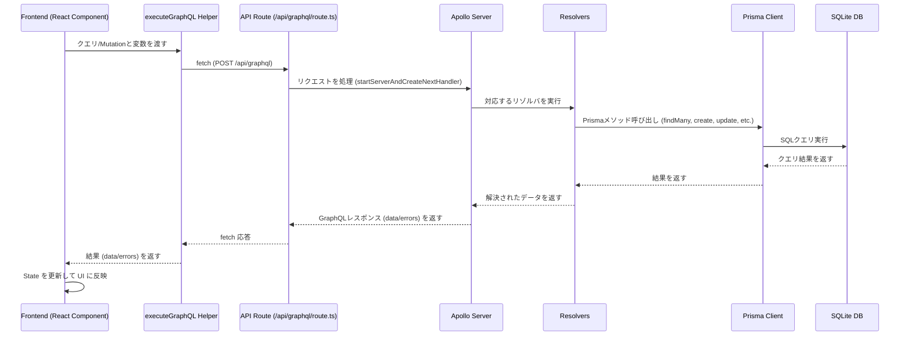

# Day 10: GraphQL Media App

GraphQL API を使った映画・書籍情報アプリ。

https://github.com/user-attachments/assets/4ce089ef-d787-4525-ad00-fb642b5da8e7

[100日チャレンジ day10](https://zenn.dev/gin_nazo/scraps/244831e544a295)

## 目的

GraphQLのスキーマ設計、リゾルバーの実装、Next.js Route Handler での GraphQL サーバー構築を通じて、GraphQL API の基本的な仕組みと利点を学習する。映画と書籍の情報を関連付けて取得・表示するシンプルなフロントエンドも作成する。

## 機能

- 映画情報（タイトル, 監督, 公開年）の管理 (CRUD)
- 書籍情報（タイトル, 著者, 出版年）の管理 (CRUD)
- 映画と書籍の関連付け (多対多)
- GraphQL API (`/api/graphql`) によるデータ操作
- フロントエンド:
  - 画面を左右に分割
  - 左側: 操作UI (一覧、詳細、追加、編集、関連付け)
  - 右側: 実行された GraphQL リクエストとレスポンスの表示

## 技術スタック

- Next.js (App Router)
- TypeScript
- Prisma (SQLite)
- GraphQL (@apollo/server, graphql)
- Tailwind CSS

## データモデル

```prisma
model Movie {
  id          Int      @id @default(autoincrement())
  title       String
  director    String
  releaseYear Int
  createdAt   DateTime @default(now())
  updatedAt   DateTime @updatedAt
  books       Book[]   @relation("MovieBook")
}

model Book {
  id              Int      @id @default(autoincrement())
  title           String
  author          String
  publicationYear Int
  createdAt       DateTime @default(now())
  updatedAt       DateTime @updatedAt
  movies          Movie[]  @relation("MovieBook")
}
```

## 起動方法

```bash
npm install
npx prisma migrate deploy
npx prisma db seed
npm run dev
```

アプリは `http://localhost:3001` で起動します。
GraphQL API エンドポイントは `http://localhost:3001/api/graphql` です。

## 注意事項

- このテンプレートはローカル開発環境を主眼としています。
- 本番デプロイには追加の考慮が必要です。
- エラーハンドリングやセキュリティは簡略化されています。

## GraphQL 通信フロー

基本的なデータ取得・更新は以下の流れで行われます。


