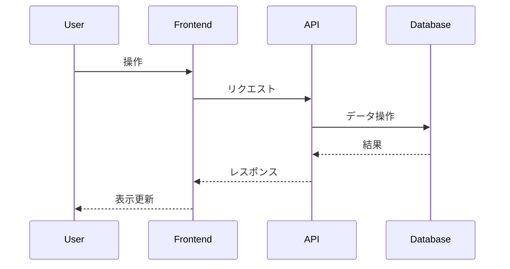

# Day 12: GUIベースのインタラクティブ・データ探索ツール

## 概要

ユーザーが複数のデータセット（CSV形式）から一つを選択し、Webブラウザ上のGUIを通じてデータのフィルタリングや集計条件を指定し、その結果をテーブルおよびグラフ形式でインタラクティブに探索できるツールです。バックエンドでDuckDBを利用し、SQLを直接書かずにデータ分析を行います。

## 機能

-   **データセット選択:** サーバー上の複数のCSVデータセットから選択可能。
-   **カラム情報表示:** 選択されたデータセットのカラム名、型、ユニーク値（カテゴリカル）を表示。
-   **GUIフィルタリング:** 数値・文字列カラムに対するフィルター条件（>, <, =, IN など）をGUIで設定。
-   **GUI集計:** グループ化カラム、集計カラム、集計関数（COUNT, SUM, AVG など）をGUIで設定。
-   **動的SQL生成:** GUIの設定に基づいてバックエンドでDuckDBのSQLクエリを生成。
-   **結果表示:**
    -   生成されたSQL文の表示。
    -   クエリ実行結果をテーブルで表示。
    -   集計結果を棒グラフなどで表示。
-   **エラーハンドリング:** 不正な操作やクエリエラー時にメッセージを表示。

## 技術スタック

-   Next.js (App Router)
-   TypeScript
-   DuckDB (Node.js)
-   Chart.js (`react-chartjs-2`)
-   Tailwind CSS
-   npm

## アプリケーション概要

*ここに、この日に作成するアプリケーションの簡単な説明を記述します。*

## 機能一覧

*ここに、実装した機能の一覧を記述します。*

- 機能1
- 機能2
- ...

## ER図

*ここに、Mermaid 形式で ER 図を記述します。*

```mermaid
erDiagram
    // 例: User モデル
    User {
        int id PK
        string name
        datetime createdAt
        datetime updatedAt
    }
```

## シーケンス図 (オプション)

*必要であれば、主要な処理フローのシーケンス図を Mermaid 形式で記述します。*



## データモデル

*ここに、主要なデータモデルの概要を記述します。*

- モデル1: 説明
- モデル2: 説明
- ...

## 画面構成

*ここに、作成する主要な画面とその概要を記述します。*

- 画面1: 説明
- 画面2: 説明
- ...

## 使用技術スタック (テンプレート標準)

- フレームワーク: Next.js (App Router)
- 言語: TypeScript
- DB: SQLite
- ORM: Prisma
- API実装: Next.js Route Handlers
- スタイリング: Tailwind CSS
- パッケージ管理: npm
- コード品質: Biome (Lint & Format)

## 開始方法

1. **依存パッケージをインストール**
   ```bash
   npm install
   ```

2. **データベースの準備**
   ```bash
   # 初回またはスキーマ変更時
   npm run db:seed
   ```

3. **開発サーバーを起動**
   ```bash
   npm run dev
   ```
   ブラウザで [http://localhost:3001](http://localhost:3001) を開くと結果が表示されます。

## 注意事項

- このテンプレートはローカル開発環境を主眼としています。
- 本番デプロイには追加の考慮が必要です。
- エラーハンドリングやセキュリティは簡略化されています。
