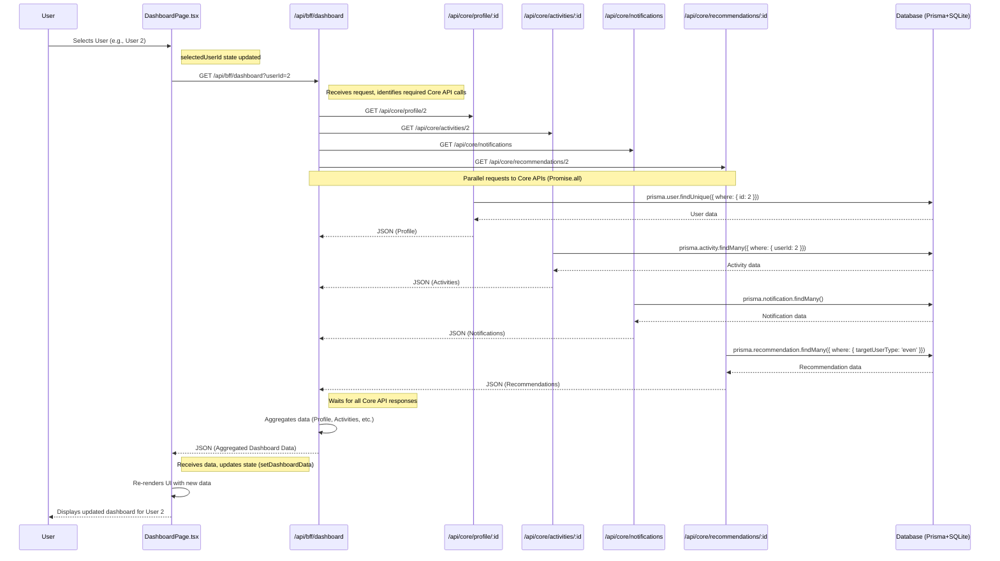

# Day 14: BFF Dashboard

## 概要

このアプリケーションは、Backend for Frontend (BFF) パターンを実装したシンプルなダッシュボードです。フロントエンド (Next.js App Router ページ) は単一の BFF API エンドポイントにリクエストを送信し、BFF は複数のコア API から必要なデータを集約してフロントエンドに返します。これにより、フロントエンドの負荷軽減と関心事の分離を目指します。

## 主な機能

-   ユーザー固有のダッシュボード情報を表示
    -   プロフィール情報
    -   最近のアクティビティ履歴
    -   共通のお知らせ
    -   ユーザーに合わせたおすすめ情報 (この例ではユーザーIDの偶奇に基づく)
-   フロントエンドのボタンで表示するユーザー (User 1 / User 2) を切り替え可能

## API エンドポイント

### BFF API

-   `GET /api/bff/dashboard?userId={id}`
    -   指定された `userId` に基づいて、以下のコア API を呼び出し、結果を集約して返す。
    -   必須データ (例: Profile) の取得に失敗した場合はエラーを返す。
    -   任意データ (例: Activities) の取得に失敗した場合は `null` を返す。

### Core APIs

-   `GET /api/core/profile/{userId}`
    -   指定されたユーザーのプロフィール情報を返す。
-   `GET /api/core/activities/{userId}`
    -   指定されたユーザーのアクティビティ履歴 (直近5件) を返す。
-   `GET /api/core/notifications`
    -   共通のお知らせ (直近3件) を返す。
-   `GET /api/core/recommendations/{userId}`
    -   指定されたユーザーへのおすすめ情報を返す (ユーザーIDの偶奇で内容を出し分け)。
-   `GET /api/users`
    -   全ユーザーのリストを返す (デバッグ用)。
-   `POST /api/users`
    -   新しいユーザーを作成する (リクエストボディに `name` と `email` が必要)。

## シーケンス図

以下は、ユーザーがフロントエンドでユーザーを選択してから、データが表示されるまでの主要な処理フローです。



## データベーススキーマ (Prisma)

SQLite データベース (`prisma/dev.db`) を使用し、以下のモデルを定義しています。

-   `User`: ユーザー情報 (id, name, email, bio など)
-   `Activity`: ユーザーのアクティビティ履歴 (userId, action, timestamp など)
-   `Notification`: お知らせ情報 (title, content, publishedAt など)
-   `Recommendation`: おすすめ情報 (itemName, imageUrl, targetUserType など)

マイグレーションは `prisma/migrations` で管理されます。
初期データは `prisma/seed.ts` で定義され、`npx prisma db seed` で投入されます。

## フロントエンド実装

-   **ページ:** `/dashboard` (`app/(pages)/dashboard/page.tsx`)
-   **実装:** React Client Component (`'use client'`)
    -   `useState` で選択中のユーザーID、ダッシュボードデータ、ローディング/エラー状態を管理。
    -   `useEffect` で選択ユーザーIDが変更された際に BFF API (`/api/bff/dashboard`) へ `fetch` リクエストを実行。
    -   取得したデータを各セクション (Profile, Activities, Notifications, Recommendations) に表示。
    -   ユーザー切り替え用のボタンを設置。
-   **スタイリング:** Tailwind CSS

## セットアップと実行

1.  **依存関係のインストール:**
    ```bash
    npm install
    ```
2.  **データベースのマイグレーション:** (初回またはスキーマ変更後)
    ```bash
    npx prisma migrate deploy
    ```
3.  **初期データの投入:**
    ```bash
    # .env ファイルが存在しない、または DATABASE_URL が相対パスで問題が発生する場合
    DATABASE_URL="file:/ABSOLUTE/PATH/TO/day14_bff_dashboard/prisma/dev.db" npx prisma db seed

    # .env が正しく設定されている場合
    # npx prisma db seed
    ```
    ※ `DATABASE_URL` は環境に合わせて設定してください。デバッグ中に絶対パスでの指定が必要になるケースがありました。
4.  **開発サーバーの起動:** (別ターミナルで実行)
    ```bash
    npm run dev
    ```
5.  **アクセス:** ブラウザで `http://localhost:3001/dashboard` を開きます。

## 技術スタック

-   フレームワーク: Next.js (App Router)
-   言語: TypeScript
-   データベース: SQLite
-   ORM: Prisma
-   スタイリング: Tailwind CSS
-   パッケージ管理: npm
