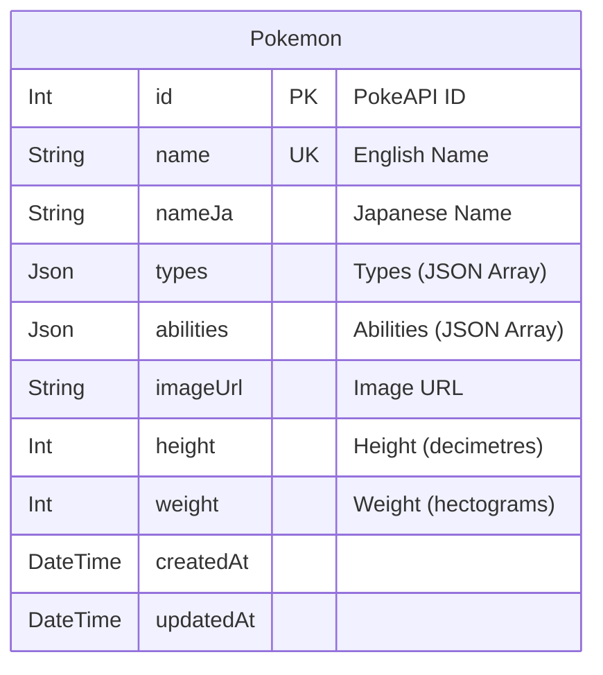

# Day 16: ポケモン図鑑検索アプリ (Elasticsearch 活用)

## 概要
Next.js, TypeScript, Prisma (SQLite), Tailwind CSS, Elasticsearch を使用して、ポケモン図鑑検索アプリケーションを開発します。
PokeAPI から取得したポケモンデータを SQLite に保存し、そのデータを Elasticsearch にインデックスして日本語対応の検索機能を提供します。


https://github.com/user-attachments/assets/3893f432-1a53-418f-ae8e-ba0d1931c288

[100日チャレンジ day16](https://zenn.dev/gin_nazo/scraps/b27182c74f3324)

## 機能一覧
- ポケモン一覧表示 (Elasticsearch から取得、ID 順)
- キーワード検索 (Elasticsearch):
  - 名前 (英語): 部分一致 (boost=2)
  - 名前 (日本語): 前方一致 (`prefix` クエリ)
  - タイプ: 完全一致 (`term` クエリ)
  - 特性: 完全一致 (`term` クエリ)
- タイプによる絞り込み (Elasticsearch `filter` クエリ)
- 日本語検索対応 (`kuromoji` アナライザー + `prefix` クエリ)

## ER図


## データモデル
- **Pokemon**: ポケモンの基本情報を格納します。
  - `id`: PokeAPI の ID を主キーとして使用。
  - `name`: 英語名 (例: `bulbasaur`)。
  - `nameJa`: 日本語名 (例: `フシギダネ`)。
  - `types`: タイプ名の配列を JSON 形式で保存 (例: `["grass", "poison"]`)。
  - `abilities`: 特性名の配列を JSON 形式で保存 (例: `["overgrow", "chlorophyll"]`)。
  - `imageUrl`: ポケモンの画像 URL。

## 画面構成
- **ルートページ (`/`)**: アプリケーションのメイン画面。
  - **検索フォーム**: キーワード入力欄とタイプ選択ドロップダウン。
  - **結果表示エリア**: 検索結果のポケモンをカード形式で一覧表示（画像、名前、タイプ）。

## Elasticsearch Index (`pokemons`)
- **Mappings**:
  - `name`: `keyword` (英語名の完全一致/前方一致検索用)
  - `nameJa`: `text` (Analyzer: `kuromoji_analyzer`), `fields.keyword` (ソート/集計/前方一致検索用)
  - `types`: `keyword` (タイプによる完全一致絞り込み用)
  - `abilities`: `keyword` (特性による完全一致絞り込み用)
  - その他: `id`, `height`, `weight` は `integer`, `imageUrl` は `keyword` (検索対象外), `createdAt`, `updatedAt` は `date`。
- **Analyzer (`kuromoji_analyzer`)**: 日本語テキスト (`nameJa`) の形態素解析に使用。

## 使用技術スタック
- Next.js (App Router)
- TypeScript
- Prisma
- SQLite
- Tailwind CSS
- **Elasticsearch (Docker, `@elastic/elasticsearch` クライアント)**
- **pokedex-promise-v2 (PokeAPI クライアント)**
- Biome (Lint & Format)

## 起動方法
```bash
# Elasticsearch 起動 (初回のみプラグインインストールが必要)
npm run es:up

# 依存関係インストール
npm install

# Prisma マイグレーション適用 & DB生成
# (既存DBがある場合は削除されることに注意)
npx prisma migrate dev --name init_pokemon

# データ投入 (PokeAPI -> SQLite)
npm run seed

# Elasticsearch へデータ投入
npm run index-es

# Next.js 開発サーバー起動
npm run dev
# または
# cd day16_pokemon_search && npm run dev

# ブラウザで http://localhost:3001 を開く

# Elasticsearch 停止
npm run es:down
```

## 注意事項
- `curl` で日本語を含む検索を行う場合は、クエリパラメータを URL エンコードしてください。
- Elasticsearch の URL はスクリプト内でハードコードされています (`http://localhost:9200`)。必要に応じて `.env` ファイルとスクリプト (`scripts/indexToEs.ts`) を修正してください。
