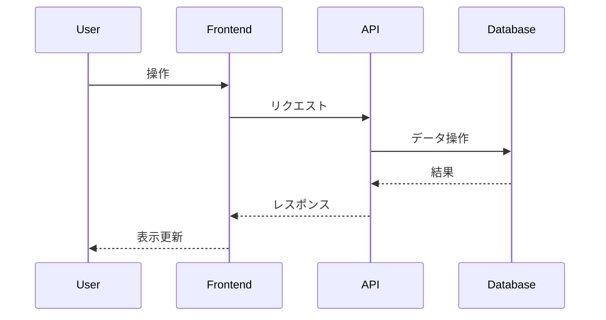

# Day 16: ポケモン図鑑検索アプリ (Elasticsearch 活用)

## 概要
Next.js (App Router), TypeScript, Prisma, SQLite, Tailwind CSS, そして Elasticsearch を使用して、ポケモン図鑑検索アプリケーションを開発します。

## 要件
- **データソース:** PokeAPI からポケモンデータを取得します (ID: 1-151)。
- **データ永続化:** ポケモンの基本情報（ID, 英語名, 日本語名, タイプ, 特性, 画像URLなど）を SQLite に保存します。
- **検索エンジン:** SQLite のデータを Elasticsearch にインデックスし、日本語対応の検索機能を提供します。
- **機能:**
    - ポケモン一覧表示（ページネーション付き）
    - キーワード検索（名前、日本語名、タイプ、特性などで検索）
    - タイプによる絞り込み検索
- **UI:** Tailwind CSS を使用したシンプルな検索インターフェースと結果表示。
- **Elasticsearch:** ローカルの Docker で動作 (`http://localhost:9200`)。`kuromoji` アナライザーを使用。

## 技術スタック
- Next.js (App Router)
- TypeScript
- Prisma
- SQLite
- Tailwind CSS
- Elasticsearch (Docker, `@elastic/elasticsearch` クライアント)
- pokedex-promise-v2 (PokeAPI クライアント)

## 起動方法
```bash
# Elasticsearch 起動 (初回のみプラグインインストールが必要)
npm run es:up

# 依存関係インストール
npm install

# Prisma マイグレーション適用
npx prisma migrate deploy

# データ投入 (PokeAPI -> SQLite)
npm run seed

# Elasticsearch へデータ投入
npm run index-es

# Next.js 開発サーバー起動
npm run dev

# Elasticsearch 停止
npm run es:down
```

## アプリケーション概要

*ここに、この日に作成するアプリケーションの簡単な説明を記述します。*

## 機能一覧

*ここに、実装した機能の一覧を記述します。*

- 機能1
- 機能2
- ...

## ER図

*ここに、Mermaid 形式で ER 図を記述します。*

```mermaid
erDiagram
    // 例: User モデル
    User {
        int id PK
        string name
        datetime createdAt
        datetime updatedAt
    }
```

## シーケンス図 (オプション)

*必要であれば、主要な処理フローのシーケンス図を Mermaid 形式で記述します。*



## データモデル

*ここに、主要なデータモデルの概要を記述します。*

- モデル1: 説明
- モデル2: 説明
- ...

## 画面構成

*ここに、作成する主要な画面とその概要を記述します。*

- 画面1: 説明
- 画面2: 説明
- ...

## 使用技術スタック (テンプレート標準)

- フレームワーク: Next.js (App Router)
- 言語: TypeScript
- DB: SQLite
- ORM: Prisma
- API実装: Next.js Route Handlers
- スタイリング: Tailwind CSS
- パッケージ管理: npm
- コード品質: Biome (Lint & Format)

## 開始方法

1. **依存パッケージをインストール**
   ```bash
   npm install
   ```

2. **データベースの準備**
   ```bash
   # 初回またはスキーマ変更時
   npm run db:seed
   ```

3. **開発サーバーを起動**
   ```bash
   npm run dev
   ```
   ブラウザで [http://localhost:3001](http://localhost:3001) を開くと結果が表示されます。

## 注意事項

- このテンプレートはローカル開発環境を主眼としています。
- 本番デプロイには追加の考慮が必要です。
- エラーハンドリングやセキュリティは簡略化されています。
