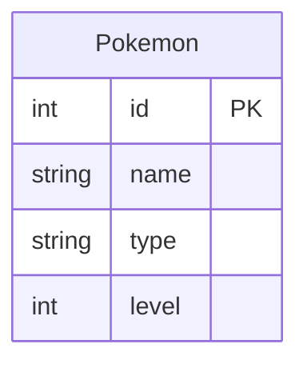
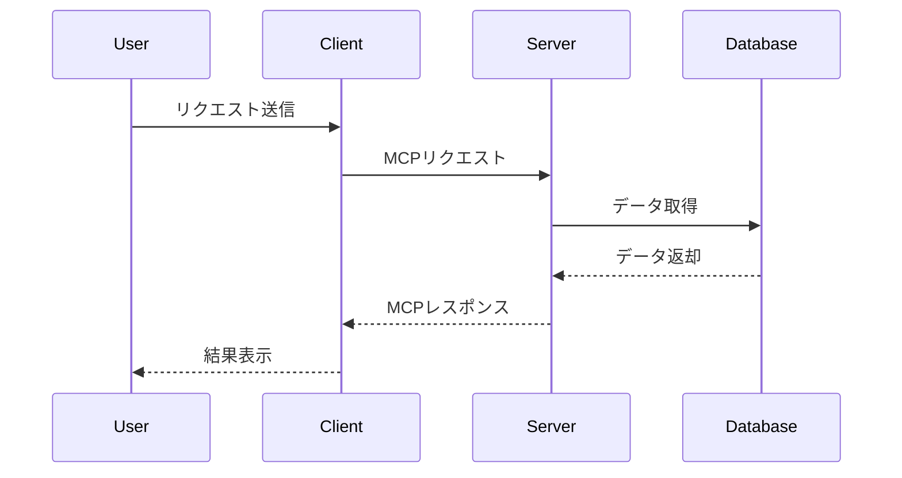

# Day 17 - MCP Pokémon

このプロジェクトは、Model Context Protocol (MCP) を使用してポケモンデータを操作するアプリケーションです。

https://github.com/user-attachments/assets/55145312-1435-4a19-997b-8cc38ccfcd17

[100日チャレンジ day17](https://zenn.dev/gin_nazo/scraps/dccf026e52feb2)

## アプリケーション概要

- ポケモンデータの取得と操作を行うバックエンドサービス。
- MCP プロトコルを活用した効率的なデータ管理。

## 機能一覧

- ポケモンデータの取得
- ポケモンデータの検索
- MCP プロトコルを使用したデータ操作

## ER図



## シーケンス図



## データモデル

- Pokemon: ポケモンの基本情報を管理

## 使用技術スタック

- 言語: Go
- MCP プロトコル
- ビルドツール: Makefile

## 開始方法

1. **依存パッケージをインストール**
   ```bash
   go mod tidy
   ```

2. **サーバーを起動**
   ```bash
   make run
   ```

3. **動作確認**
   ブラウザまたはクライアントツールでエンドポイントにアクセスして動作を確認します。

## 注意事項

- このプロジェクトはローカル開発環境を前提としています。
- 本番環境での利用には追加のセキュリティ対策が必要です。
