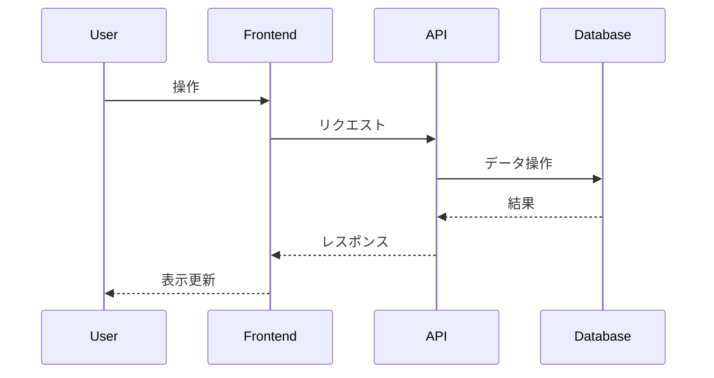

# Day 18 - Expandable REST API

Stripe API の `expand` パラメータのように、関連データを動的に展開できる REST API を実装します。

## 機能

- 投稿 (`Post`)、ユーザー (`User`)、プロフィール (`Profile`)、コメント (`Comment`) の CRUD API (GET のみ実装)
- GET リクエスト時に `expand` クエリパラメータで関連データを指定して展開
  - 例: `/api/posts?expand=author,comments`
- `max_depth` クエリパラメータで展開する階層の深さを制限
  - 例: `/api/posts?expand=comments.author.profile&max_depth=2` (コメントの作者プロフィールは展開されない)

## 技術スタック

- Next.js (App Router)
- TypeScript
- Prisma
- SQLite
- Tailwind CSS

## アプリケーション概要

*ここに、この日に作成するアプリケーションの簡単な説明を記述します。*

## 機能一覧

*ここに、実装した機能の一覧を記述します。*

- 機能1
- 機能2
- ...

## ER図

*ここに、Mermaid 形式で ER 図を記述します。*

```mermaid
erDiagram
    // 例: User モデル
    User {
        int id PK
        string name
        datetime createdAt
        datetime updatedAt
    }
```

## シーケンス図 (オプション)

*必要であれば、主要な処理フローのシーケンス図を Mermaid 形式で記述します。*



## データモデル

*ここに、主要なデータモデルの概要を記述します。*

- モデル1: 説明
- モデル2: 説明
- ...

## 画面構成

*ここに、作成する主要な画面とその概要を記述します。*

- 画面1: 説明
- 画面2: 説明
- ...

## 使用技術スタック (テンプレート標準)

- フレームワーク: Next.js (App Router)
- 言語: TypeScript
- DB: SQLite
- ORM: Prisma
- API実装: Next.js Route Handlers
- スタイリング: Tailwind CSS
- パッケージ管理: npm
- コード品質: Biome (Lint & Format)

## 開始方法

1. **依存パッケージをインストール**
   ```bash
   npm install
   ```

2. **データベースの準備**
   ```bash
   # 初回またはスキーマ変更時
   npm run db:seed
   ```

3. **開発サーバーを起動**
   ```bash
   npm run dev
   ```
   ブラウザで [http://localhost:3001](http://localhost:3001) を開くと結果が表示されます。

## 注意事項

- このテンプレートはローカル開発環境を主眼としています。
- 本番デプロイには追加の考慮が必要です。
- エラーハンドリングやセキュリティは簡略化されています。
