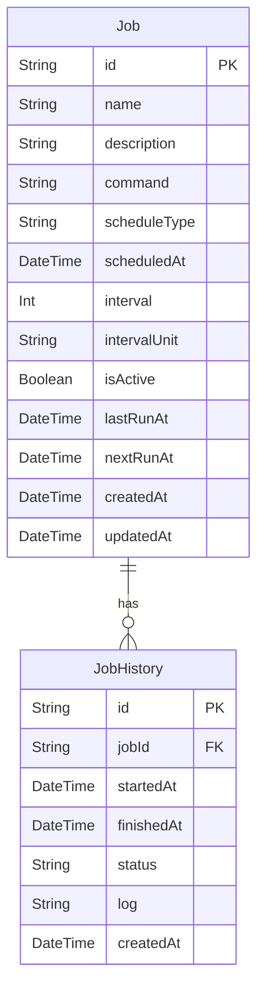

# Day19 - ジョブスケジューラ

このプロジェクトは [Next.js](https://nextjs.org) (App Router)、TypeScript、Prisma、SQLite を使用した簡易的なジョブスケジューラです。タスクを定期的または特定の時間に実行するスケジューリング機能を提供します。

## アプリケーション概要

シンプルなジョブスケジューラシステムで、ユーザーがタスクを登録し、一定の時間間隔または特定の時間に実行されるようスケジュールできるアプリケーションです。ジョブの実行はシミュレーションとして表現され、実行履歴がデータベースに記録されます。

## 機能一覧

- ジョブの作成・編集・削除
- スケジュール設定（一回のみ実行、定期実行）
- ジョブの有効/無効切り替え
- ジョブの手動実行
- ジョブの実行履歴表示
- ジョブのステータス管理（待機中、実行中、成功、失敗）

## ER図



## データモデル

- **Job**: ジョブの基本情報とスケジュール設定を管理
  - スケジュールタイプ: 'once'(一回のみ) または 'interval'(定期実行)
  - 間隔単位: 'minute', 'hour', 'day'

- **JobHistory**: ジョブの実行履歴
  - ステータス: 'running', 'success', 'failed'

## 画面構成

- **ジョブ一覧画面**: 全てのジョブとそのステータスを表示
- **ジョブ作成/編集フォーム**: 新規ジョブの作成と既存ジョブの編集
- **ジョブ詳細画面**: ジョブの詳細情報と実行履歴を表示

## 使用技術スタック

- フレームワーク: Next.js (App Router)
- 言語: TypeScript
- DB: SQLite
- ORM: Prisma
- API実装: Next.js Route Handlers
- スタイリング: Tailwind CSS
- パッケージ管理: npm

## 開始方法

1. **依存パッケージをインストール**
   ```bash
   npm install
   ```

2. **データベースの準備**
   ```bash
   npx prisma migrate deploy
   ```

3. **開発サーバーを起動**
   ```bash
   npm run dev
   ```
   ブラウザで [http://localhost:3001](http://localhost:3001) を開くと結果が表示されます。

## 技術的な実装メモ

- ジョブの実行は実際にはシミュレーションのみ（ステータス更新と履歴記録）
- クライアントからのポーリングでジョブ状態を更新
- ジョブの次回実行時間はサーバーサイドで計算
