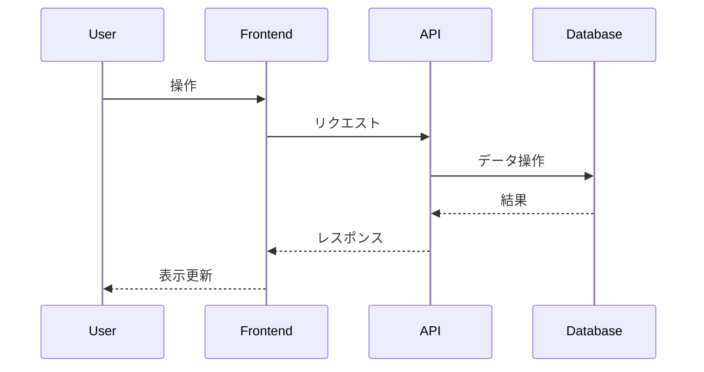

# Day 20 - SQL Parser & Validator

Go言語でSQLクエリ（主にSELECT文）をパースし、AST（抽象構文木）を生成・可視化し、スキーマ定義に基づいてバリデーションを行うツールです。

## 主な機能

- SQLパース (SELECT, WHERE, JOIN, GROUP BY, HAVING, ORDER BY, LIMIT)
- AST生成
- AST可視化 (Mermaid.js)
- スキーマ定義に基づくバリデーション
- Web UI (Next.js)
- API (Go)

## 技術スタック

- フロントエンド: Next.js (App Router), TypeScript, Tailwind CSS, Monaco Editor, Mermaid.js
- バックエンド: Go
- DB: なし (スキーマはファイル/メモリ管理)

## アプリケーション概要

*ここに、この日に作成するアプリケーションの簡単な説明を記述します。*

## 機能一覧

*ここに、実装した機能の一覧を記述します。*

- 機能1
- 機能2
- ...

## ER図

*ここに、Mermaid 形式で ER 図を記述します。*

```mermaid
erDiagram
    // 例: User モデル
    User {
        int id PK
        string name
        datetime createdAt
        datetime updatedAt
    }
```

## シーケンス図 (オプション)

*必要であれば、主要な処理フローのシーケンス図を Mermaid 形式で記述します。*



## データモデル

*ここに、主要なデータモデルの概要を記述します。*

- モデル1: 説明
- モデル2: 説明
- ...

## 画面構成

*ここに、作成する主要な画面とその概要を記述します。*

- 画面1: 説明
- 画面2: 説明
- ...

## 使用技術スタック (テンプレート標準)

- フレームワーク: Next.js (App Router)
- 言語: TypeScript
- DB: SQLite
- ORM: Prisma
- API実装: Next.js Route Handlers
- スタイリング: Tailwind CSS
- パッケージ管理: npm
- コード品質: Biome (Lint & Format)

## 開始方法

1. **依存パッケージをインストール**
   ```bash
   npm install
   ```

2. **データベースの準備**
   ```bash
   # 初回またはスキーマ変更時
   npm run db:seed
   ```

3. **開発サーバーを起動**
   ```bash
   npm run dev
   ```
   ブラウザで [http://localhost:3001](http://localhost:3001) を開くと結果が表示されます。

## 注意事項

- このテンプレートはローカル開発環境を主眼としています。
- 本番デプロイには追加の考慮が必要です。
- エラーハンドリングやセキュリティは簡略化されています。
