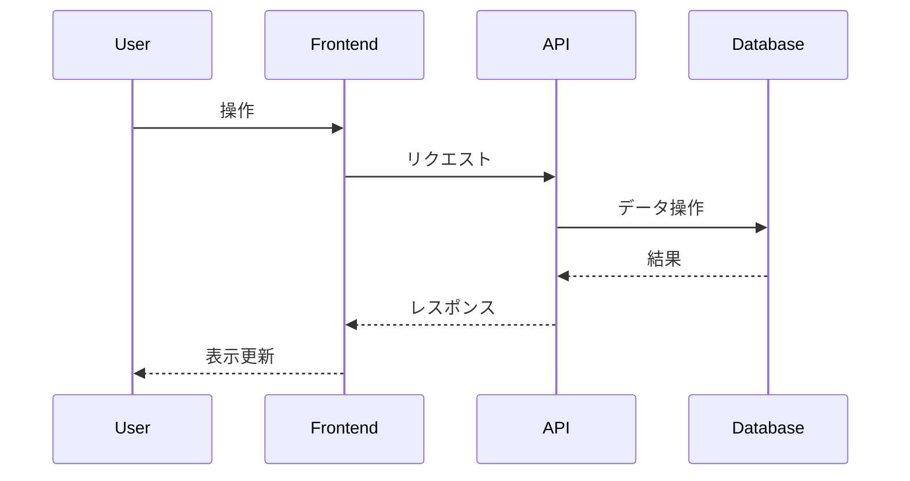

# Day 21 - Facility Reservation System

カレンダー形式で設備の空き状況を確認し、予約・管理を行うシステム。

## 主要機能

- 設備管理 (登録・編集・削除)
- カレンダー表示 (月/週/日、react-big-calendar 使用)
- 予約機能 (重複チェックあり)
- マイ予約一覧・キャンセル
- シンプルなユーザー切り替え機能

## 技術スタック

- Next.js (App Router)
- TypeScript
- Prisma
- SQLite
- Tailwind CSS
- react-big-calendar
- date-fns

## データモデル

- `User`: id, name
- `Facility`: id, name, description, capacity?, availableStartTime?, availableEndTime?
- `Reservation`: id, facilityId, userId, startTime, endTime

## APIエンドポイント

- `GET /api/facilities`
- `POST /api/facilities`
- `PUT /api/facilities/:id`
- `DELETE /api/facilities/:id`
- `GET /api/reservations?facilityId=...&start=...&end=...`
- `GET /api/reservations?userId=...`
- `POST /api/reservations`
- `DELETE /api/reservations/:id`

## アプリケーション概要

*ここに、この日に作成するアプリケーションの簡単な説明を記述します。*

## 機能一覧

*ここに、実装した機能の一覧を記述します。*

- 機能1
- 機能2
- ...

## ER図

*ここに、Mermaid 形式で ER 図を記述します。*

```mermaid
erDiagram
    // 例: User モデル
    User {
        int id PK
        string name
        datetime createdAt
        datetime updatedAt
    }
```

## シーケンス図 (オプション)

*必要であれば、主要な処理フローのシーケンス図を Mermaid 形式で記述します。*



## 画面構成

*ここに、作成する主要な画面とその概要を記述します。*

- 画面1: 説明
- 画面2: 説明
- ...

## 使用技術スタック (テンプレート標準)

- フレームワーク: Next.js (App Router)
- 言語: TypeScript
- DB: SQLite
- ORM: Prisma
- API実装: Next.js Route Handlers
- スタイリング: Tailwind CSS
- パッケージ管理: npm
- コード品質: Biome (Lint & Format)

## 開始方法

1. **依存パッケージをインストール**
   ```bash
   npm install
   ```

2. **データベースの準備**
   ```bash
   # 初回またはスキーマ変更時
   npm run db:seed
   ```

3. **開発サーバーを起動**
   ```bash
   npm run dev
   ```
   ブラウザで [http://localhost:3001](http://localhost:3001) を開くと結果が表示されます。

## 注意事項

- このテンプレートはローカル開発環境を主眼としています。
- 本番デプロイには追加の考慮が必要です。
- エラーハンドリングやセキュリティは簡略化されています。
