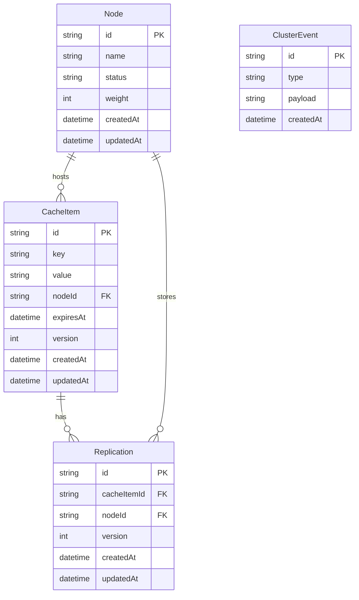
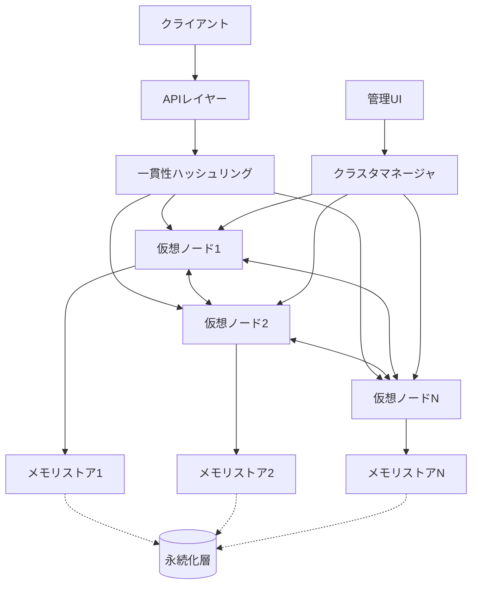
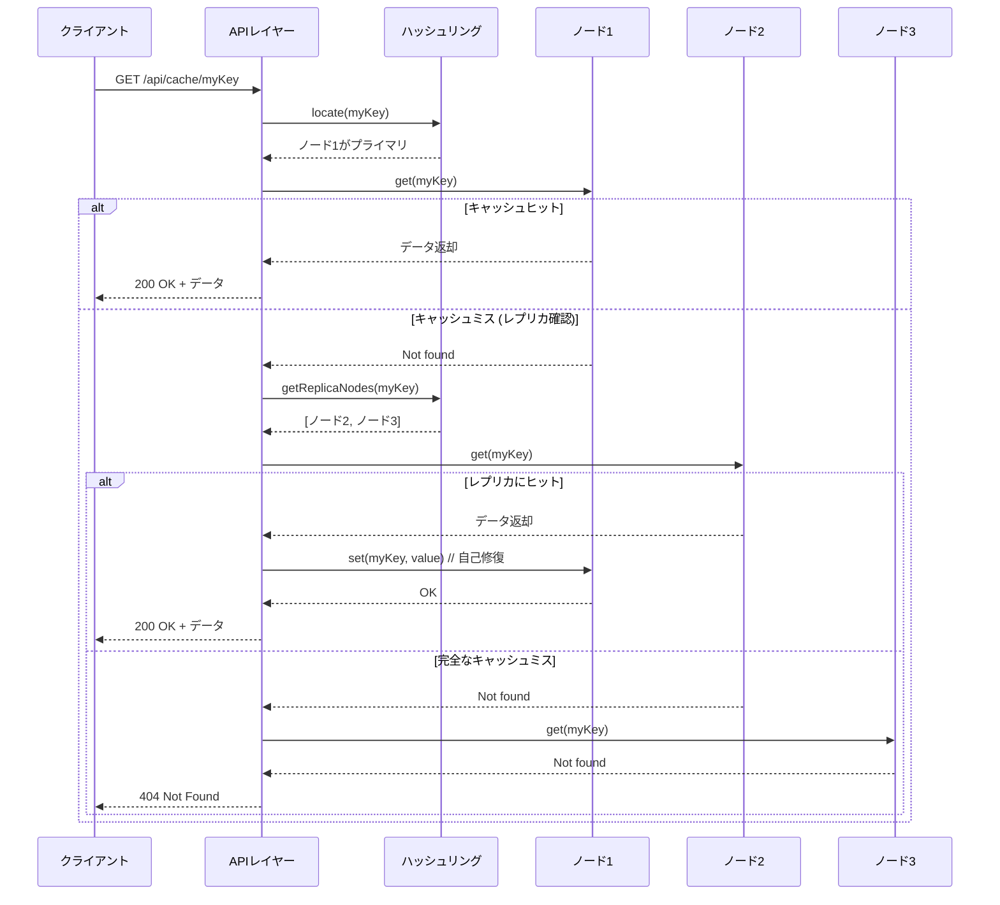

# Day22 - 分散キャッシュシステム

Next.js、TypeScript、WebSocketを使用した分散キャッシュシステムのシミュレーションを構築します。複数の仮想ノードを単一サーバー上でシミュレートし、分散キャッシュの概念と動作を学習するためのアプリケーションです。

https://github.com/user-attachments/assets/48828a01-2b67-42ca-b961-df16551d5d01

[100日チャレンジ day22](https://zenn.dev/gin_nazo/scraps/47bc6a1b772384)

## アプリケーション概要

このシステムは複数のキャッシュノード間でデータを分散して保存・管理する仕組みを提供します。実際の分散システムをシミュレートし、一貫性ハッシュによるデータ分散、レプリケーション、障害対応などの概念を実装します。シンプルなWebインターフェースを通じて、システムの動作を視覚的に確認できます。

## 機能一覧

- ✅ 基本的なキャッシュ操作 (GET/SET/DELETE)
- ✅ データの有効期限 (TTL) 管理
- ✅ 一貫性ハッシュによるデータ分散
- ✅ ノード間データレプリケーション
- ✅ ノード追加/削除時のデータ再配置
- ✅ シミュレーション機能（ノード障害、ネットワーク分断など）
- ✅ システム状態の可視化ダッシュボード
- ✅ キャッシュ操作UIとデータ可視化

## ER図



## システムアーキテクチャ



## シーケンス図: キャッシュデータの取得



## 作業工程

本プロジェクトは以下の工程で段階的に実装を進めました：

### 1. 基本設計と準備 ✅
- システム全体の設計とアーキテクチャ策定
- データモデル定義
- API仕様の策定

### 2. コアキャッシュ機能実装 ✅
- 単一ノードでのキャッシュ機能実装
- キー/バリュー操作の基本APIの実装
- TTL、バージョン管理等の基本機能

### 3. 分散機能実装 ✅
- 一貫性ハッシュアルゴリズム実装
- 仮想ノード機能実装
- ノード間通信レイヤー実装

### 4. レプリケーション・耐障害機能 ✅
- データレプリケーション機能
- 障害検知機能
- リバランシング機能

### 5. 管理UI・可視化 ✅ (現在のフェーズ)
- システム状態ダッシュボード
- データ分布の可視化
- シミュレーション操作インターフェース

### 6. パフォーマンス最適化と拡張機能 🔜
- キャッシュ戦略の最適化
- パフォーマンス計測機能
- 高度な管理機能

## 実装済み機能の詳細

### 一貫性ハッシュリング
- MD5ハッシュを使用したキー分散
- 仮想ノードによるバランス調整
- 障害時の自動フェイルオーバー

### レプリケーション
- プライマリ/レプリカモデル
- データの冗長化と耐障害性
- バージョン管理による一貫性確保

### 障害シミュレーション
- ノードダウン
- ネットワーク遅延
- パーティション

### 管理インターフェース
- リアルタイムクラスタステータス
- ノード追加/削除UI
- イベント履歴と監視

## API仕様

### キャッシュ操作API

#### GET /api/cache/:key
- 説明: キャッシュから値を取得
- レスポンス:
  - 200: `{ value: string, metadata: { expiry: string, ... } }`
  - 404: `{ error: "Not found" }`

#### POST /api/cache/:key
- 説明: キャッシュに値を設定
- リクエスト: `{ value: string, ttl?: number }`
- レスポンス:
  - 200: `{ success: true }`
  - 400: `{ error: string }`

#### DELETE /api/cache/:key
- 説明: キャッシュから値を削除
- レスポンス:
  - 200: `{ success: true }`
  - 404: `{ error: "Not found" }`

### クラスタ管理API

#### GET /api/cluster/nodes
- 説明: 全ノード情報取得
- レスポンス: `{ nodes: Node[] }`

#### POST /api/cluster/nodes
- 説明: ノード追加
- リクエスト: `{ name: string, weight?: number }`
- レスポンス: `{ node: Node }`

#### DELETE /api/cluster/nodes/:nodeId
- 説明: ノード削除
- レスポンス: `{ success: true }`

#### POST /api/cluster/rebalance
- 説明: データの再配置を実行
- レスポンス: `{ success: true, stats: { movedItems: number } }`

### シミュレーションAPI

#### POST /api/simulation/failure
- 説明: ノード障害をシミュレート
- リクエスト: `{ nodeId: string, type: "down" | "slow" | "partition" }`
- レスポンス: `{ success: true }`

#### POST /api/simulation/recover
- 説明: ノード復旧をシミュレート
- リクエスト: `{ nodeId: string }`
- レスポンス: `{ success: true }`

## データモデル

- **Node**: キャッシュノードの情報を管理
  - id: ノード識別子
  - name: 表示名
  - status: ノードの状態 ("active", "down" など)
  - weight: 一貫性ハッシュでのウェイト値

- **CacheItem**: キャッシュアイテムを表現
  - id: アイテム識別子
  - key: キャッシュキー
  - value: キャッシュ値
  - nodeId: 所属ノードID
  - expiresAt: 有効期限
  - version: バージョン番号

- **Replication**: レプリケーション情報
  - cacheItemId: 元キャッシュアイテムのID
  - nodeId: レプリカが存在するノードID
  - version: レプリカのバージョン

- **ClusterEvent**: クラスタ操作の履歴
  - type: イベント種別
  - payload: イベント詳細

## 画面構成

- **メインダッシュボード**: クラスタ全体の状態を表示
- **ノード管理画面**: ノードの追加・削除・状態変更
- **キャッシュブラウザ**: キャッシュデータの閲覧・操作
- **シミュレーション画面**: 障害・復旧のシミュレーション
- **デモアプリケーション**: キャッシュ利用のサンプル
- **メトリクス画面**: パフォーマンス指標の表示

## 開始方法

1. **依存パッケージをインストール**
   ```bash
   npm install
   ```

2. **データベースの準備**
   ```bash
   npx prisma migrate deploy
   npm run db:seed
   ```

3. **開発サーバーを起動**
   ```bash
   npm run dev
   ```
   ブラウザで [http://localhost:3001](http://localhost:3001) を開くと結果が表示されます。

## 注意事項

- このテンプレートはローカル開発環境を主眼としています。
- 本番デプロイには追加の考慮が必要です。
- エラーハンドリングやセキュリティは簡略化されています。
