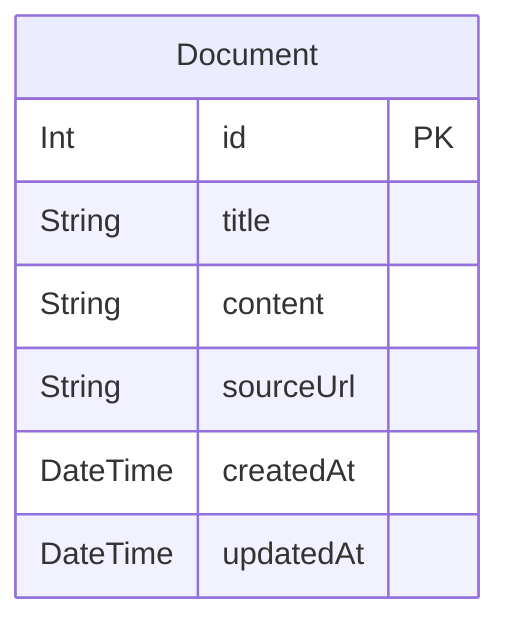

# Day 24: 簡易RAG (Retrieval-Augmented Generation) システム (ベクトル検索版)

## 概要

このプロジェクトは、Next.js (App Router)、TypeScript、Prisma、SQLite、Tailwind CSS に加え、`@xenova/transformers` ライブラリを利用して構築された、簡易的なRAG (Retrieval-Augmented Generation) システムです。
ユーザーは特定の知識ソース（名探偵コナン関連のWikipediaページ）に対して質問でき、システムは**意味的に関連する情報**をベクトル検索で特定し、その情報に基づいて応答を生成します。

知識ソースのテキストは、`transformers.js` の Embedding モデル (`Xenova/multilingual-e5-small`) によってベクトル化され、**インメモリ**にキャッシュされます。ユーザーの質問も同様にベクトル化され、**コサイン類似度**を用いて最も関連性の高いドキュメントを検索します。

応答生成（Generation）の部分は、実際のLLMを使用せず、検索されたドキュメントを用いた固定テンプレートによるシミュレーションとして実装されます。

## 知識ソース

知識ベースは、以下のWikipediaページのテキストコンテンツから構成されます。

*   名探偵コナン: [https://ja.wikipedia.org/wiki/名探偵コナン](https://ja.wikipedia.org/wiki/名探偵コナン)
*   名探偵コナンの漫画エピソード一覧: [https://ja.wikipedia.org/wiki/名探偵コナンの漫画エピソード一覧](https://ja.wikipedia.org/wiki/名探偵コナンの漫画エピソード一覧)

これらのデータは、初期データとしてSQLiteデータベース (`prisma/dev.db`) の `Document` テーブルに登録 (seed) され、アプリケーション起動後（または最初のAPIリクエスト時）にベクトル化されてメモリにキャッシュされます。

## 機能一覧

*   **RAG質問インターフェース:** ユーザーが質問を入力できるシンプルなUI。
*   **関連ドキュメント検索 (ベクトル検索):** 入力された質問をベクトル化し、事前にベクトル化された知識ベース（インメモリキャッシュ）とコサイン類似度を比較して、最も意味的に類似したドキュメントを検索します。
*   **応答生成 (シミュレーション):** 検索で見つかったドキュメント情報を含む、事前定義されたテンプレートを使用して応答文を生成します。
    *   例 (発見時): `「${ドキュメントタイトル}」の情報によると、あなたの質問「${質問文}」に関連すると思われる記述は以下の通りです。「${ドキュメント本文の冒頭200文字}...」`
    *   例 (未発見時): `申し訳ありませんが、「${質問文}」に関連する明確な情報は知識ベースの中に見つかりませんでした。`

## ER図



## 使用技術スタック

*   フレームワーク: Next.js (App Router)
*   言語: TypeScript
*   DB: SQLite
*   ORM: Prisma
*   ベクトル化/検索: `@xenova/transformers` (Embeddingモデル: `Xenova/multilingual-e5-small`, インメモリキャッシュ, コサイン類似度)
*   API実装: Next.js Route Handlers
*   スタイリング: Tailwind CSS
*   パッケージ管理: npm

## セットアップと実行方法

1.  **依存パッケージをインストール:**
    ```bash
    npm install
    ```
2.  **データベースのマイグレーションと初期データ投入:**
    ```bash
    # 開発用マイグレーション作成 (初回)
    npx prisma migrate dev --name init
    # 初期データ投入
    npm run db:seed
    ```
    *(注意: `prisma/seed.js` でWikipediaデータを登録します)*
3.  **開発サーバーを起動:**
    ```bash
    npm run dev
    ```
    ブラウザで [http://localhost:3001](http://localhost:3001) を開きます。
    初回アクセス時、またはサーバー起動時に Embedding モデルのダウンロードとベクトルキャッシュの初期化が行われるため、最初の応答には時間がかかる場合があります。

## APIエンドポイント

*   `POST /api/rag`
    *   説明: ユーザーからの質問を受け付け、関連情報をベクトル検索し、応答を生成します。
    *   リクエストボディ: `{ "query": "ユーザーの質問文字列" }`
    *   レスポンスボディ: `{ "response": "生成された応答文字列", "sources": [{ "id": number, "title": string, "url": string }] }` (応答の根拠となったドキュメント情報のリスト)

## 注意事項

*   ベクトル検索の精度は使用する Embedding モデルに依存します。
*   全ドキュメントのベクトルをインメモリで保持するため、データ量によってはメモリ消費量が増加します。
*   応答生成はテンプレートベースであり、高度な自然言語処理は行いません。
*   Wikipediaデータはデモンストレーション目的で使用します。
