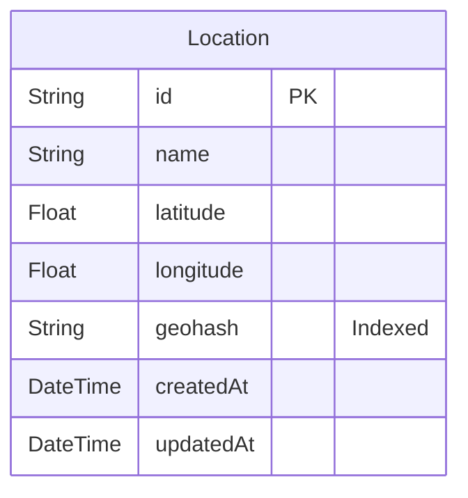

# Day 25 - 地理空間インデックス (Geohash) を利用した近傍検索API

緯度経度で指定された地点情報を登録・管理し、Geohash を利用して特定の地点の近くにある他の地点を効率的に検索する API および Web UI を提供します。

https://github.com/user-attachments/assets/e01d0f10-b518-4076-84fe-8b20e63fee6a

[100日チャレンジ day25](https://zenn.dev/gin_nazo/scraps/d25e09ee96e17d)

## 主な機能

*   地点の登録 (名前, 緯度, 経度) - 登録時に Geohash (精度9) を自動計算して保存
*   近傍地点の検索 (中心となる緯度経度、Geohash 精度を指定)
*   地点登録フォーム
*   近傍検索フォームと結果表示

## 技術スタック

*   Next.js (App Router)
*   TypeScript
*   Prisma
*   SQLite
*   Tailwind CSS
*   ngeohash (Geohash 計算ライブラリ)

## API エンドポイント

*   `POST /api/locations`: 新しい地点を登録 (Request Body: `{ name: string, latitude: number, longitude: number }`)
*   `GET /api/locations`: 登録済みの全地点を取得 (デバッグ・確認用、UIでは未使用)
*   `GET /api/locations/nearby?lat={latitude}&lng={longitude}&precision={geohash_precision}`: 近傍地点を検索

## セットアップと実行

```bash
# 依存関係のインストール
npm install

# .env ファイルの作成 (存在しない場合)
# DATABASE_URL="file:./dev.db" を記述

# マイグレーションファイルの作成とDB適用 (初回またはスキーマ変更時)
npx prisma migrate dev --name init

# (任意) サンプルデータの投入
npx prisma db seed

# 開発サーバーの起動
npm run dev
```

サーバーは `http://localhost:3001` で起動します。

## アプリケーション概要

このアプリケーションは、Geohash という技術を用いて、特定の地点の近くにある場所を高速に検索する機能を提供します。地点情報を登録すると、その場所に対応する Geohash が計算され、データベースに保存されます。近傍検索では、指定した地点と検索範囲（Geohash 精度）に基づいて、関連する Geohash を持つ地点を効率的にリストアップします。

## 機能一覧

- **地点登録:** Web UI のフォームから、場所の名前、緯度、経度を入力して地点をデータベースに登録できます。登録時に精度9のGeohashが自動生成されます。
- **近傍検索:** Web UI のフォームから、検索の中心となる緯度・経度と、検索範囲の広さを示す Geohash 精度（1〜9）を入力すると、該当する範囲内の登録済み地点を検索し、結果を表示します。
- **API:** 上記の登録・検索機能を提供する REST API を実装しています。

## ER図



## データモデル

- **Location:** 地点情報を格納するモデル。
    - `id`: 一意な識別子 (UUID)
    - `name`: 地点の名前
    - `latitude`: 緯度
    - `longitude`: 経度
    - `geohash`: 計算された Geohash 文字列 (精度9)。近傍検索のためにインデックスが設定されています。
    - `createdAt`, `updatedAt`: 作成日時と更新日時。

## 画面構成

- **ルートページ (`/`)**
    - 地点登録フォーム (`LocationForm` コンポーネント): 名前、緯度、経度を入力。
    - 近傍検索フォーム (`NearbySearch` コンポーネント): 中心の緯度経度、Geohash 精度を入力し、検索結果をテーブル表示。

## 使用技術スタック (テンプレート標準)

- フレームワーク: Next.js (App Router)
- 言語: TypeScript
- DB: SQLite
- ORM: Prisma
- API実装: Next.js Route Handlers
- スタイリング: Tailwind CSS
- パッケージ管理: npm
- コード品質: Biome (Lint & Format)

## 開始方法

1. **依存パッケージをインストール**
   ```bash
   npm install
   ```
2. **環境変数の設定**
   プロジェクトルートに `.env` ファイルを作成し、以下を記述します。
   ```
   DATABASE_URL="file:./dev.db"
   ```
3. **データベースの準備**
   ```bash
   # スキーマ定義からマイグレーションファイルを作成し、DBに適用
   npx prisma migrate dev --name init
   ```
4. **(任意) サンプルデータの投入**
   ```bash
   npx prisma db seed
   ```
5. **開発サーバーを起動**
   ```bash
   npm run dev
   ```
   ブラウザで [http://localhost:3001](http://localhost:3001) を開くとアプリケーションが表示されます。

## 注意事項

- このテンプレートはローカル開発環境を主眼としています。
- 本番デプロイには追加の考慮が必要です。
- エラーハンドリングやセキュリティは簡略化されています。
