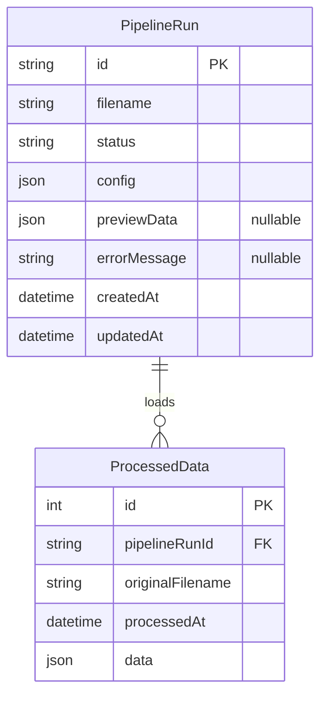
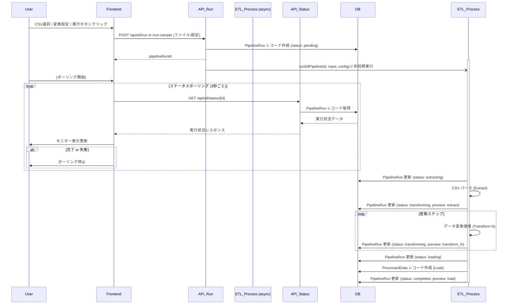

# Day 29: 簡易 ETL パイプライン

このプロジェクトは、CSV ファイルを入力とし、ユーザーが定義した変換処理を経てデータベースにデータをロードする簡易的な ETL (Extract, Transform, Load) パイプラインを Web UI 上で実行・可視化するアプリケーションです。

https://github.com/user-attachments/assets/b486bf96-0039-4c61-b6f5-c5e040815ef2

[100日チャレンジ day29](https://zenn.dev/gin_nazo/scraps/3f7980415e3009)

## アプリケーション概要

Web UI を通じて CSV データの取り込み、変換ルールの設定、パイプラインの実行、そして各ステップでのデータ変化のプレビューが可能です。バックエンドの処理状況はフロントエンドにポーリングで通知され、ユーザーはリアルタイムで進捗を確認できます。

## 機能一覧

-   **データソース選択:** ローカルからの CSV ファイルアップロード、またはサーバー上のサンプル CSV 利用。
-   **変換ルール定義:**
    -   列選択
    -   文字列操作 (大文字/小文字化)
    -   数値演算 (定数加算/乗算)
    -   行フィルタリング (条件指定)
-   **パイプライン実行:** 定義したルールに基づき ETL 処理を開始。
-   **リアルタイムモニタリング:** パイプラインの各ステップ (Extract, Transform 0..N, Load) のステータス表示。
-   **データプレビュー:** 各ステップ完了時点でのデータサンプル (先頭5行) を表示。
-   **データロード:** 最終的なデータを SQLite の `ProcessedData` テーブルに保存。
-   **実行履歴管理:** パイプラインの実行情報を `PipelineRun` テーブルに記録。

## ER図



## シーケンス図 (パイプライン実行フロー)



## データモデル

-   `PipelineRun`: パイプラインの各実行を表す。実行ID、入力ファイル名、設定、ステータス、各ステップのプレビューデータ、エラーメッセージなどを保持。
-   `ProcessedData`: 変換・ロードされたデータを1行ずつ保持。どのパイプライン実行によるものかを示す `pipelineRunId` を持つ。

## 画面構成

-   **メインページ (`/`)**: 単一ページ構成。
    -   左側: データソース選択 (ファイルアップロード/サンプル選択)、変換設定 UI、実行ボタン。
    -   右側: パイプライン実行モニター (ステータス、ステップごとのデータプレビュー表示)。

## 使用技術スタック (テンプレート標準)

- フレームワーク: Next.js (App Router)
- 言語: TypeScript
- DB: SQLite
- ORM: Prisma
- API実装: Next.js Route Handlers
- スタイリング: Tailwind CSS
- パッケージ管理: npm
- CSV パース: papaparse

## 開始方法

1. **依存パッケージをインストール**
   ```bash
   npm install
   ```

2. **データベースの準備**
   ```bash
   # 初回またはスキーマ変更時
   npx prisma migrate dev --name init
   # または開発中のスキーマ同期
   # npx prisma db push
   ```

3. **開発サーバーを起動**
   ```bash
   npm run dev
   ```
   ブラウザで [http://localhost:3001](http://localhost:3001) を開くと結果が表示されます。

## 注意事項

- このアプリケーションは学習目的であり、大規模データや本番環境での利用は想定していません。
- エラーハンドリングやセキュリティは簡略化されています。
- Prisma の型解決に関する Linter エラーがエディタ上で残る場合がありますが、実行には影響ありません（エディタ/TSサーバーの再起動で解消される可能性があります）。
