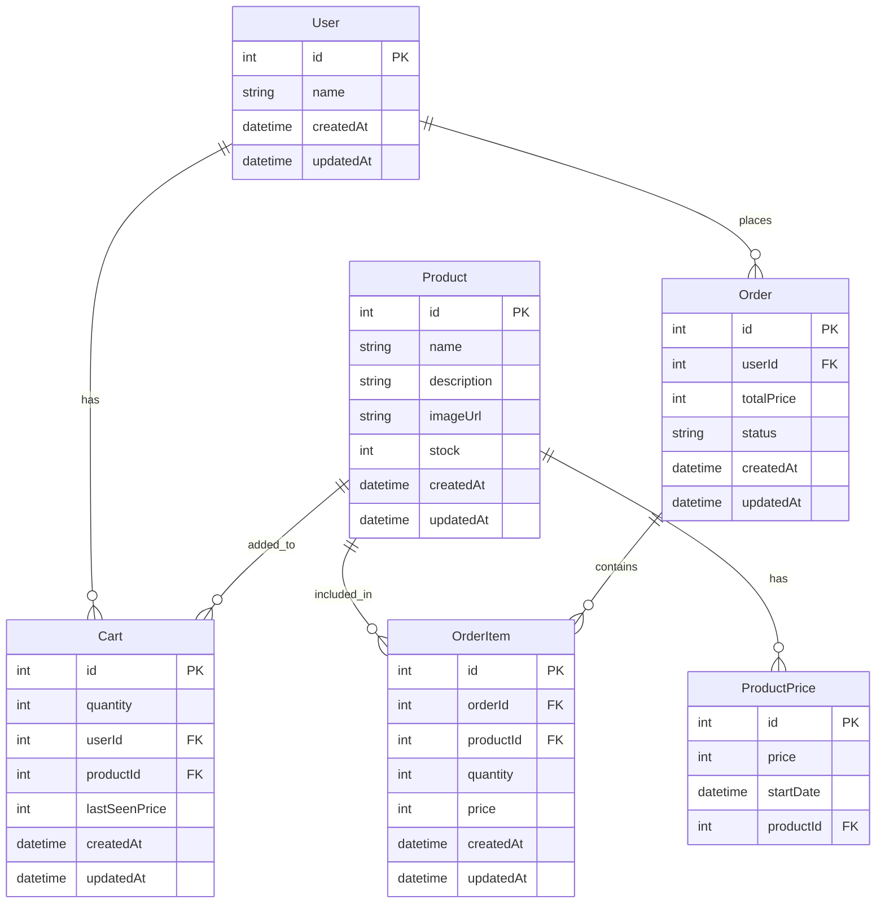
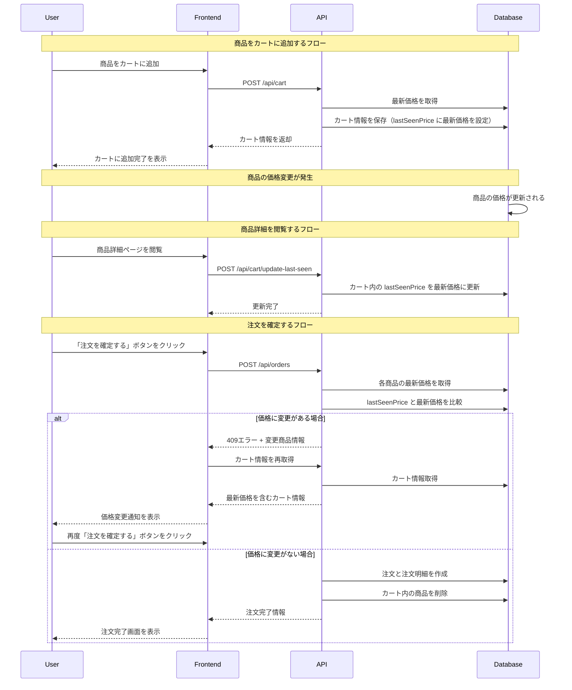

# Day2 - シンプルECサイト

https://github.com/user-attachments/assets/0bdc4c35-60dc-411b-8966-dbcecf2bee13

## 機能一覧
- 商品一覧表示
- 商品詳細表示
- カート機能（追加・削除・数量変更）
- 注文確定プロセス
- 注文履歴表示
- 価格変動履歴 (ProductPrice テーブル)
- 定期的な価格更新（フロントエンドトリガーによるデモ実装）

## ER図



## 価格更新時の処理フロー



## データモデル
- 商品（Product）：名前、説明、画像URL、在庫数
- 価格履歴（ProductPrice）：商品ID、価格、適用開始日
- カート（Cart）：ユーザーID、商品ID、数量, lastSeenPrice
- 注文（Order）：ユーザーID、注文日、合計金額、ステータス
- 注文明細（OrderItem）：注文ID、商品ID、数量、価格（注文時の価格を記録）

## 画面構成
- ヘッダー：ロゴ、カートアイコン、ユーザー切替
- 商品一覧ページ：カード形式の商品表示
- 商品詳細ページ：商品情報、カートに追加ボタン
- カートページ：カート内商品一覧、数量変更、合計金額表示、注文ボタン
- 注文完了ページ：注文番号表示、ありがとうメッセージ
- 注文履歴ページ：過去の注文一覧

## 機能と技術
- Next.js App Router
- Prisma ORM
- SQLite データベース
- React Context（カート状態、ユーザー状態管理）
- Tailwind CSS（UI実装）

## 開始方法

1. このテンプレートをコピーして新しい日のディレクトリを作成します：

```bash
cp -r template/ {日付}_アプリ名/
cd {日付}_アプリ名/
```

2. `package.json` の `name` フィールドを適切なものに変更します。

3. 依存パッケージをインストールします：

```bash
npm install
```

4. 開発サーバーを起動します：

```bash
npm run dev
```

ブラウザで [http://localhost:3001](http://localhost:3001) を開くと結果が表示されます。

## データベース (Prisma + SQLite)

このテンプレートでは Prisma ORM を使用して SQLite データベースにアクセスします。

### スキーマの修正

`prisma/schema.prisma` ファイルを編集してデータモデルを定義します：

```prisma
model User {
  id        Int      @id @default(autoincrement())
  name      String
  createdAt DateTime @default(now())
  updatedAt DateTime @updatedAt
}

// 新しいモデルを追加...
```

### マイグレーションの実行

スキーマを変更したら、以下のコマンドを実行してデータベースを更新します：

```bash
npx prisma migrate dev --name 変更の説明
```

### Prisma Client の生成

スキーマ変更後または初回クローン時には Prisma Client を生成します：

```bash
npx prisma generate
```

### データベースの確認

Prisma Studio を使用してデータベースの内容を確認・編集できます：

```bash
npx prisma studio
```

## コード品質管理 (Biome)

このプロジェクトでは [Biome](https://biomejs.dev/) を使用して、コードのリンティングとフォーマットを行います。Biome は ESLint と Prettier の代替として機能する高速なツールキットです。

### 使用可能なコマンド

```bash
# リンティング
npm run lint

# フォーマット
npm run format

# リンティングとフォーマットを一度に実行（推奨）
npm run check
```

## API エンドポイント

サンプルの API エンドポイントが `app/api/users/route.ts` にあります。新しいエンドポイントは `app/api/` ディレクトリ内に追加します。

### 利用例

```typescript
// データの取得
const response = await fetch('/api/users');
const users = await response.json();

// データの作成
await fetch('/api/users', {
  method: 'POST',
  headers: { 'Content-Type': 'application/json' },
  body: JSON.stringify({ name: 'ユーザー名' })
});
```

## プロジェクト構成

```
/
├── app/                  # App Router ディレクトリ
│   ├── api/              # API Route Handlers
│   │   └── users/        # ユーザー関連 API
│   │       └── route.ts  # GET, POST メソッド実装
│   ├── layout.tsx        # 共通レイアウト
│   ├── globals.css       # グローバル CSS
│   └── page.tsx          # ホームページ
├── components/           # 共有 UI コンポーネント
├── prisma/               # Prisma 関連
│   ├── schema.prisma     # データモデル定義
│   ├── migrations/       # マイグレーション履歴
│   └── dev.db            # SQLite データベース
├── lib/                  # 共通ロジック
│   └── db.ts             # Prisma Client
├── biome.json            # Biome 設定
└── ... その他の設定ファイル
```

## 注意事項

- このテンプレートは開発環境のみを想定しています。
- 本番環境へのデプロイには追加の設定が必要です。
- エラー処理やセキュリティは簡略化されています。
