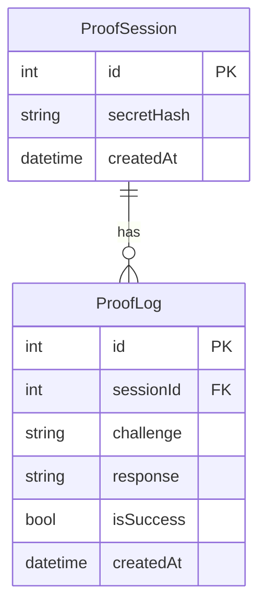

# Day33 - ゼロ知識証明 "体験型" デモアプリ

## 概要
数学や暗号の知識がなくても「ゼロ知識証明（ZKP）」の"魔法"を直感的に体験できるWebアプリです。
「秘密の内容は絶対に明かさず、"知っている"ことだけを証明できる」ことを、ストーリーやUIで分かりやすく伝えます。

- 宝箱の中身（秘密の単語）を知っていることを、直接明かさずに証明できる体験
- クイズ形式で「本当に知っているか？」を何度も判定
- ITが分からない人でも直感的に理解できる可視化・説明
- 専門用語はUIに出さず、裏側で自動処理

## 機能一覧
- 「証明したい」ボタンで体験開始
- サーバ（またはフロント）からクイズ出題
- ユーザーは「秘密を明かさず」クイズに回答
- 1回ごとに判定し、何度も繰り返し体験可能
- 「秘密は絶対に見せていません！」の強調表示
- 送信データややりとりの図解・可視化

## ER図
（体験重視のためDBは最小限。証明履歴やユーザー情報を保存する場合のみ拡張）


## データモデル
- ProofSession: 証明体験のセッション情報（秘密のハッシュなど）
- ProofLog: 各クイズ（チャレンジ）の履歴

## 画面構成
- トップページ：アプリ説明、体験開始ボタン
- 証明体験ページ：
  - 宝箱のイラストと「秘密は見せません！」の強調
  - クイズ出題・回答UI
  - 判定結果・体験ログ・図解
- （オプション）解説・ヒントページ

## 使用技術スタック
- フレームワーク: Next.js (App Router)
- 言語: TypeScript
- DB: SQLite
- ORM: Prisma
- API実装: Next.js Route Handlers
- スタイリング: Tailwind CSS
- パッケージ管理: npm
- コード品質: Biome (Lint & Format)

## 開始方法
1. 依存パッケージをインストール
   ```bash
   npm install
   ```
2. データベースの準備
   ```bash
   npm run db:seed
   ```
3. 開発サーバーを起動
   ```bash
   npm run dev
   ```
   ブラウザで [http://localhost:3001](http://localhost:3001) を開くと体験できます。

## 注意事項
- このアプリは体験・教育用途です。本番利用やセキュリティ要件は考慮していません。
- エラーハンドリングやセキュリティは簡略化しています。
