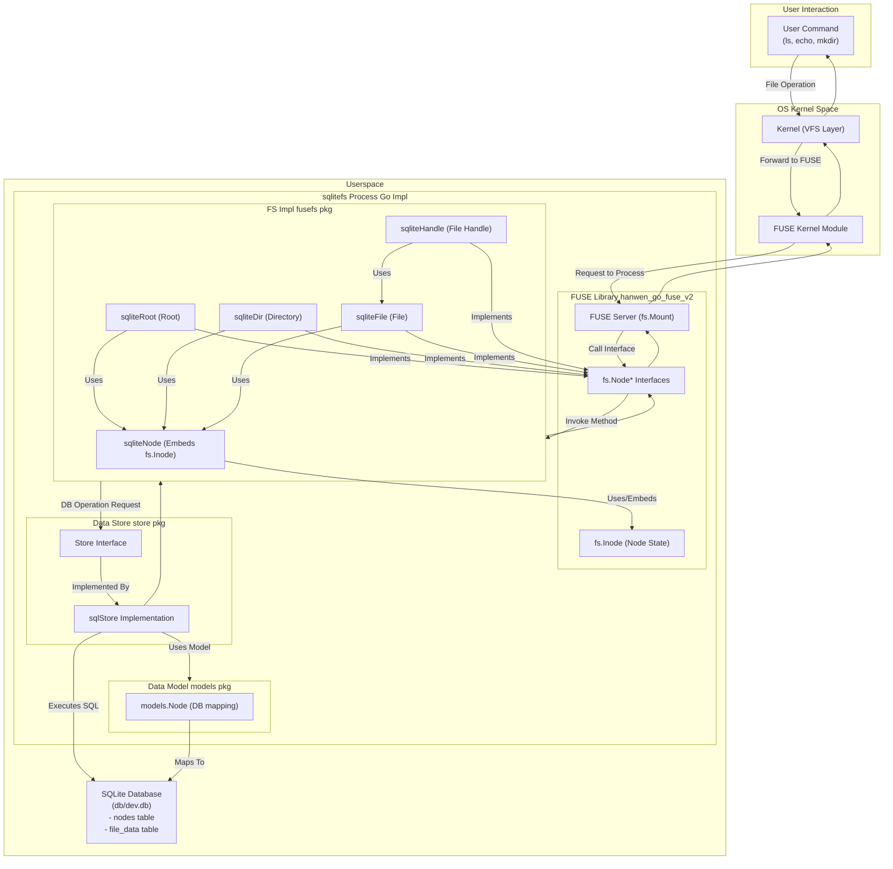

# Day 36: Go による FUSE SQLite ファイルシステム

このプロジェクトは、Go を使用して FUSE (Filesystem in Userspace) に基づくユーザースペースファイルシステムを実装します。ファイルやディレクトリのメタデータ、およびファイルの内容のバックエンドストレージとして SQLite データベースを使用します。

https://github.com/user-attachments/assets/6aaf21ba-5fee-4b94-97cc-1834e00a6ce9

[100日チャレンジ day36](https://zenn.dev/gin_nazo/scraps/2c6a1fc6ba5310)

## 概要

- **言語:** Go
- **FUSE ライブラリ:** `github.com/hanwen/go-fuse/v2`
- **データベース:** SQLite (`github.com/mattn/go-sqlite3`)
- **ストレージ:**
    - メタデータ（inode 情報、名前、パーミッション、タイムスタンプなど）は `nodes` テーブルに保存されます。
    - ファイルの内容は `file_data` テーブルに BLOB として保存されます。
- **目的:** FUSE の実装と、ユーザースペースファイルシステムと OS カーネル間の相互作用について学習します。

## 機能

- FUSE によるマウント可能なファイルシステム (`macfuse.io` または Linux FUSE が必要)。
- ファイルシステムの構造とデータを SQLite DB (`db/dev.db`) に保存。
- 基本的な操作をサポート:
    - `mkdir`, `rmdir`
    - `touch`, `create` (ファイルの新規作成)
    - `ls`, `stat` (属性取得: Getattr)
    - `echo "..." > file` (書き込み: Write)
    - `cat file` (読み込み: Read)
    - `rm file` (削除: Unlink)
    - ファイルサイズの切り詰め (Truncate: `Setattr` でサイズ指定)

## ビルドと実行方法

1.  **前提条件:**
    *   Go コンパイラ (>= 1.18)
    *   `macfuse` (macOS の場合) または FUSE 開発ヘッダー (Linux の場合)。
2.  **ビルド:**
    ```bash
    cd day36_fuse_sqlite_fs_go
    go build -o sqlitefs .
    ```
3.  **マウントポイント作成:**
    ```bash
    # day36_fuse_sqlite_fs_go ディレクトリ内に作成
    mkdir mnt
    chmod 755 mnt
    ```
4.  **実行 (マウント):**
    *   `day36_fuse_sqlite_fs_go` ディレクトリでターミナルを開きます。
    *   実行可能ファイルを実行し、マウントポイントとデータベースパスを指定します (信頼性のため絶対パス推奨):
        ```bash
        go run . -mountpoint mnt
        ```
    *   詳細な FUSE 操作ログを表示するには `-debug` フラグを追加します:
        ```bash
        ./sqlitefs -mountpoint=... -db=... -debug
        ```
5.  **操作:**
    *   **別の** ターミナルを開きます。
    *   マウントポイント (`/path/to/.../mnt`) に対して、通常のコマンド (`ls`, `cd`, `mkdir`, `touch`, `echo`, `cat`, `rm` など) を使用します。
6.  **アンマウント:**
    *   `sqlitefs` を実行しているターミナルで `Ctrl+C` を押します。
    *   クリーンにアンマウントできない場合は、`diskutil unmount /path/to/.../mnt` (macOS) または `fusermount -u /path/to/.../mnt` (Linux) が必要になることがあります。

## シーケンス




## 注意点

- データベースファイル (`db/dev.db`) は、初回実行時に存在しない場合、自動的に作成されます。
- `db/dev.db` ファイルを削除すると、ファイルシステムの内容がリセットされます。
- ファイルの内容は、読み書き操作中に Go プロセス内のメモリに完全に保持され、その後 SQLite の BLOB に読み書きされます。これは大きなファイルには非効率的です。
- 拡張属性 (`xattr`) は現在サポートされていません。
- ハードリンクはサポートされていません（リンクカウントは常に 1 です）。
- macOS では、マウントポイント自体に対して `ls -la` を実行すると、FUSE/OS の挙動により所有者が `root wheel` と表示される場合がありますが、マウントポイント **内部に** 作成されたファイルは、実行中のプロセスとデータベースのエントリに基づいて正しいユーザー/グループの所有権を持つはずです。
