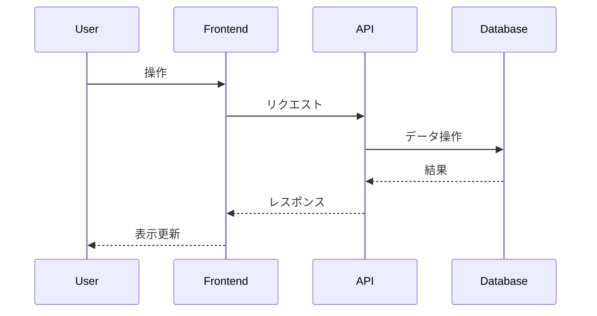

# Day39 - インタラクティブCoWストレージシミュレーター

## 概要

このアプリケーションは、ストレージ技術における Copy-on-Write (CoW) の動作原理をインタラクティブかつ視覚的に理解するためのシミュレーターです。
ユーザーは仮想ディスク上でファイル操作（作成、編集、削除）やスナップショット作成を行い、その際のデータブロックの割り当て、共有、CoWによる新規コピーの発生などをグラフィカルに確認できます。

## 目的

- Copy-on-Write (CoW) の概念とそのメリット（ストレージ効率、スナップショットの高速作成）を視覚的に学ぶ。
- スナップショットがどのようにデータの一貫性を保ちつつ、過去の時点を記録するかを理解する。
- データブロックレベルでのファイルシステムの挙動を抽象的に捉える。

## 主な機能

- 仮想ディスクとファイルシステムの視覚的表現
- ファイル作成、編集（ランダムな文字列で上書き）、削除機能
- スナップショット作成機能
- CoW発生時のブロックレベルでの変更の可視化
  - 未使用ブロック、割り当て済みブロック、共有ブロックなどを色分け表示
- スナップショット間の関係性（ツリーやタイムライン形式）の表示
- （オプション）ストレージ使用量（論理 vs 物理）の表示
- （オプション）スナップショットのサーバーへの保存・読み込み

## デザインテーマ

- ミニマリズムとデータビジュアライゼーションの融合

## 技術スタック

- Next.js (App Router)
- TypeScript
- Tailwind CSS
- Zustand (または React Context + useReducer) for Client-side state management
- SQLite (スナップショットメタデータの永続化オプション)
- better-sqlite3

## アプリケーション概要

*ここに、この日に作成するアプリケーションの簡単な説明を記述します。*

## 機能一覧

*ここに、実装した機能の一覧を記述します。*

- 機能1
- 機能2
- ...

## ER図

*ここに、Mermaid 形式で ER 図を記述します。*

```mermaid
erDiagram
    // 例: User モデル
    User {
        int id PK
        string name
        datetime createdAt
        datetime updatedAt
    }
```

## シーケンス図 (オプション)

*必要であれば、主要な処理フローのシーケンス図を Mermaid 形式で記述します。*



## データモデル

*ここに、主要なデータモデルの概要を記述します。*

- モデル1: 説明
- モデル2: 説明
- ...

## 画面構成

*ここに、作成する主要な画面とその概要を記述します。*

- 画面1: 説明
- 画面2: 説明
- ...

## 使用技術スタック (テンプレート標準)

- フレームワーク: Next.js (App Router)
- 言語: TypeScript
- DB: SQLite
- DBアクセス: better-sqlite3（または同等のシンプルなSQLiteライブラリ）
- API実装: Next.js Route Handlers
- スタイリング: Tailwind CSS
- パッケージ管理: npm
- コード品質: Biome (Lint & Format)

## 開始方法

1. **依存パッケージをインストール**
   ```bash
   npm install
   ```

2. **開発サーバーを起動**
   ```bash
   npm run dev
   ```
   サーバ起動時に自動でSQLiteのテーブルが作成されます。
   ブラウザで [http://localhost:3001](http://localhost:3001) を開くと結果が表示されます。

3. **DBスキーマを変更したい場合**
   - `db/dev.db` ファイルを削除してください
   - 次回サーバ起動時に新しいスキーマで自動生成されます。

## 注意事項

- このテンプレートはローカル開発環境を主眼としています。
- 本番デプロイには追加の考慮が必要です。
- エラーハンドリングやセキュリティは簡略化されています。
