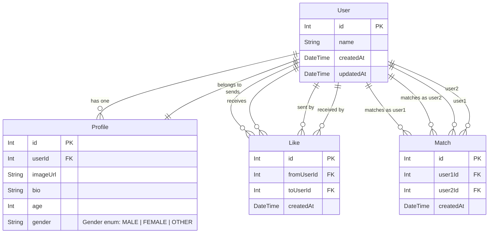
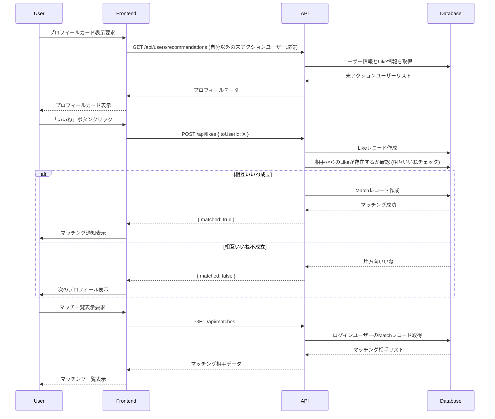

# Day 3: Matching App

異性（または同性）のプロフィールを見て「いいね」か「スキップ」を選択し、相互に「いいね」となった場合にマッチングが成立するWebアプリケーションです。

[100日チャレンジ day3 の記録](https://zenn.dev/gin_nazo/scraps/bd59dbec76935d)

https://github.com/user-attachments/assets/3e7eb151-18dd-44f6-b570-1b53f378af36

## 機能一覧

- ユーザープロフィール表示 (カード形式)
- プロフィールへの「いいね」アクション
- プロフィールへの「スキップ」アクション
- 相互いいねによるマッチング成立ロジック
- マッチング成立時の画面通知
- マッチングしたユーザーの一覧表示
- 開発用の簡易ユーザー切り替え機能

## ER図



## シーケンス図 (オプション)



## データモデル

- **User**: アプリケーションのユーザー。基本的な認証情報（今回は名前のみ）を持つ。
- **Profile**: ユーザーの詳細情報（画像URL、自己紹介、年齢、性別）。User と 1対1 の関係。
- **Like**: あるユーザーから別のユーザーへの「いいね」アクションを記録。`fromUserId` (いいねした人) と `toUserId` (いいねされた人) を持つ。
- **Match**: 相互に「いいね」が成立したユーザーペアを記録。`user1Id` と `user2Id` を持つ。

## 画面構成

- **プロフィール表示/スワイプ画面**: メイン画面。ログインユーザー以外のプロフィールがカード形式で表示され、「いいね」「スキップ」ボタンで操作する。
- **マッチング一覧画面**: ログインユーザーがこれまでにマッチングした相手の一覧を表示する。
- **ユーザー切り替え**: ヘッダーなどに配置し、開発中に操作ユーザーを簡単に切り替えるためのドロップダウンなど。

## 使用技術スタック (テンプレート標準)

- フレームワーク: Next.js (App Router)
- 言語: TypeScript
- DB: SQLite
- ORM: Prisma
- API実装: Next.js Route Handlers
- スタイリング: Tailwind CSS
- パッケージ管理: npm
- コード品質: Biome (Lint & Format)

## 開始方法

1. **依存パッケージをインストール**
   ```bash
   npm install
   ```

2. **データベースの準備**
   ```bash
   # 初回またはスキーマ変更時
   npm run db:seed
   ```

3. **開発サーバーを起動**
   ```bash
   npm run dev
   ```
   ブラウザで [http://localhost:3001](http://localhost:3001) を開くと結果が表示されます。

## 注意事項

- このテンプレートはローカル開発環境を主眼としています。
- 本番デプロイには追加の考慮が必要です。
- エラーハンドリングやセキュリティは簡略化されています。
