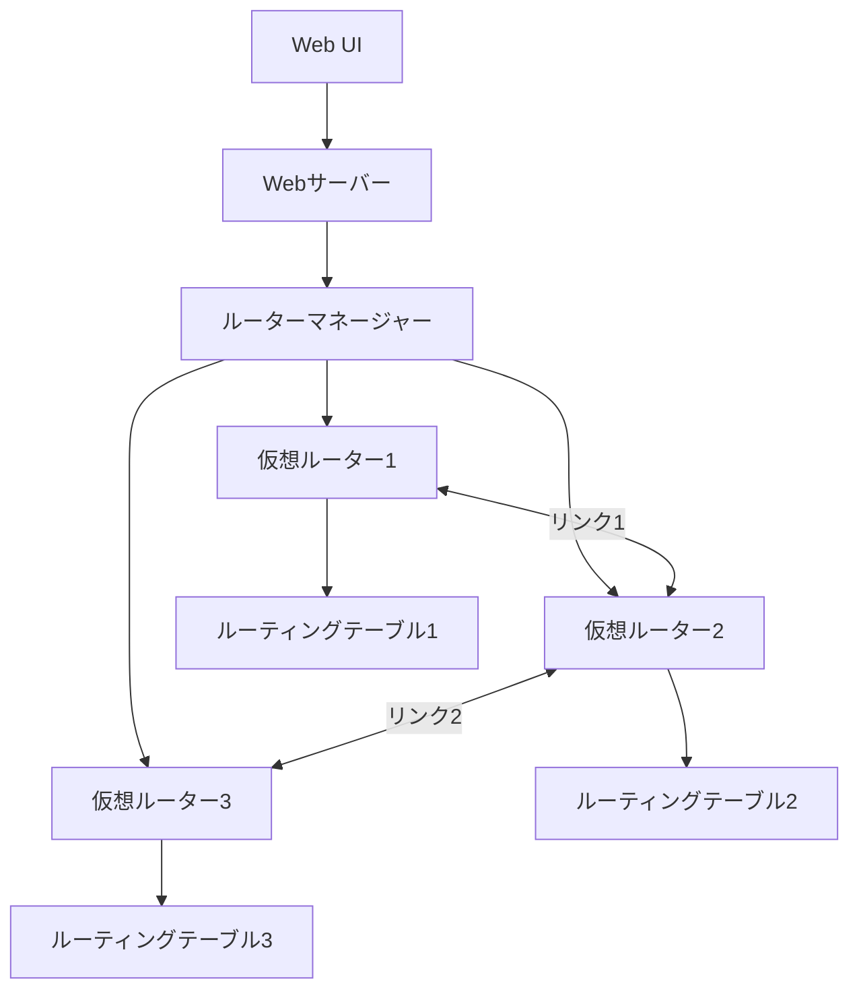

# Day43 - 複数仮想ルーターシミュレーター

このプロジェクトは、複数の仮想ルーターを1つのサーバー上でシミュレーションするアプリケーションです。ルーティングテーブルやパケット転送、リンク障害などのネットワークの挙動を視覚的に理解できます。

## アプリケーション概要

複数の仮想ルーターを作成し、それらを仮想リンクで接続して、実際のネットワーク環境をシミュレートします。ルーティングテーブルの管理、静的ルートの追加・削除、リンク障害のシミュレーションなどを通して、ネットワークルーティングの仕組みを学ぶことができます。

## 機能一覧

- **複数仮想ルーターの同時シミュレーション**
  - ルーターごとの独立したルーティングテーブル管理
  - インターフェース管理
  - パケット統計情報

- **ルーター間の仮想リンク**
  - 帯域幅・レイテンシ・パケットロス率の設定
  - リンク障害シミュレーション

- **ルーティング機能**
  - 静的ルーティング
  - 最長一致法によるルート検索
  - RIPの基本機能（経路情報交換）

- **Webインターフェース**
  - ネットワークトポロジーの可視化
  - ルーティングテーブルの管理
  - Ping機能によるパケット転送テスト

## アーキテクチャ



## データモデル

### ルーター
- ID: ルーターの一意識別子
- Name: ルーターの表示名
- Interfaces: インターフェースのマップ
- RoutingTable: ルーティングテーブル
- RIPEnabled: RIP有効フラグ
- PacketStatistics: パケット統計情報

### インターフェース
- Name: インターフェース名
- IPAddress: IPアドレス
- SubnetMask: サブネットマスク
- IsUp: 稼働状態
- MTU: Maximum Transmission Unit
- RemoteLink: 接続先リンク

### リンク
- ID: リンクの一意識別子
- Bandwidth: 帯域幅
- Latency: レイテンシ
- DropRate: パケットドロップ率
- IsUp: 稼働状態
- Endpoint1/2: 両端のエンドポイント情報

### ルーティングテーブルエントリ
- Network: ネットワークアドレス
- SubnetMask: サブネットマスク
- NextHop: ネクストホップIP
- Interface: 出力インターフェース
- Metric: メトリック値
- Source: 経路情報源（直接接続/静的/RIP）

## 画面構成

1. **トップページ(インデックス)**
   - ルーター一覧
   - リンク一覧と状態切り替え
   - 基本操作へのアクセス

2. **ルーター詳細ページ**
   - ルーター基本情報
   - インターフェース一覧
   - ルーティングテーブル
   - 静的ルート追加フォーム
   - Ping送信フォーム
   - パケット統計情報

3. **トポロジーページ**
   - ネットワーク全体の可視化
   - ルーターとリンクの状態表示
   - ズーム・パン操作

## 技術スタック

- 言語: **Go**
- TUNインターフェース: github.com/songgao/water
- パケット処理: github.com/google/gopacket
- Webサーバー: 標準ライブラリ http, html/template
- フロントエンド: HTML, CSS, JavaScript
- グラフィック描画: SVG

## 開始方法

1. **プロジェクトのビルド**
   ```bash
   go build -o router_sim ./cmd
   ```

2. **アプリケーションの実行**
   ```bash
   sudo ./router_sim
   ```
   ※ TUNインターフェース操作にはroot権限が必要です

3. **Web UIへのアクセス**
   
   ブラウザで [http://localhost:3001](http://localhost:3001) を開きます

## 注意事項

- このアプリケーションはシミュレーション目的で作成されており、実際のネットワーク環境に適用する場合は追加の考慮が必要です。
- TUNインターフェースを使用する場合はroot権限が必要です。
- 本プロジェクトは教育・学習目的のために作成されています。
