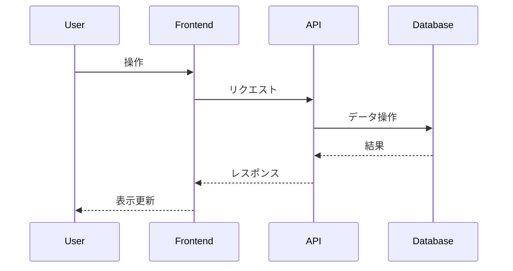

# Day46 - ACME対応 簡易認証局シミュレーター

## 概要

ユーザーが認証局 (CA) の運営と、ACMEプロトコルによる証明書発行プロセスを体験できるシミュレーションアプリケーション。
従来の証明書発行フローに加え、ACMEサーバーとして振る舞い、ACMEクライアント (UIで操作) からの要求に応じてドメイン検証を行い、証明書を発行する機能を持つ。

## デザインテーマ

グラスモーフィズム x ミニマリズム

## 主な機能

- 従来型のCAとしての証明書発行・管理 (CSR手動受付、発行、失効、簡易CRL表示)
- ACMEサーバーとしての証明書発行 (アカウント作成、オーダー、HTTP-01チャレンジ検証、証明書発行)
- ACMEクライアントのUIシミュレーション (証明書発行フローのステップ実行)

## 技術スタック

- 言語: TypeScript
- フレームワーク: Next.js (App Router)
- DB: SQLite
- DBアクセス: better-sqlite3
- API: Next.js Route Handlers
- スタイリング: Tailwind CSS
- コード品質: Biome

## アプリケーション概要

*ここに、この日に作成するアプリケーションの簡単な説明を記述します。*

## 機能一覧

*ここに、実装した機能の一覧を記述します。*

- 機能1
- 機能2
- ...

## ER図

*ここに、Mermaid 形式で ER 図を記述します。*

```mermaid
erDiagram
    // 例: User モデル
    User {
        int id PK
        string name
        datetime createdAt
        datetime updatedAt
    }
```

## シーケンス図 (オプション)

*必要であれば、主要な処理フローのシーケンス図を Mermaid 形式で記述します。*



## データモデル

*ここに、主要なデータモデルの概要を記述します。*

- モデル1: 説明
- モデル2: 説明
- ...

## 画面構成

*ここに、作成する主要な画面とその概要を記述します。*

- 画面1: 説明
- 画面2: 説明
- ...

## 開始方法

1. **依存パッケージをインストール**
   ```bash
   npm install
   ```

2. **開発サーバーを起動**
   ```bash
   npm run dev
   ```
   サーバ起動時に自動でSQLiteのテーブルが作成されます。
   ブラウザで [http://localhost:3001](http://localhost:3001) を開くと結果が表示されます。

3. **DBスキーマを変更したい場合**
   - `db/dev.db` ファイルを削除してください
   - 次回サーバ起動時に新しいスキーマで自動生成されます。

## 注意事項

- このテンプレートはローカル開発環境を主眼としています。
- 本番デプロイには追加の考慮が必要です。
- エラーハンドリングやセキュリティは簡略化されています。
