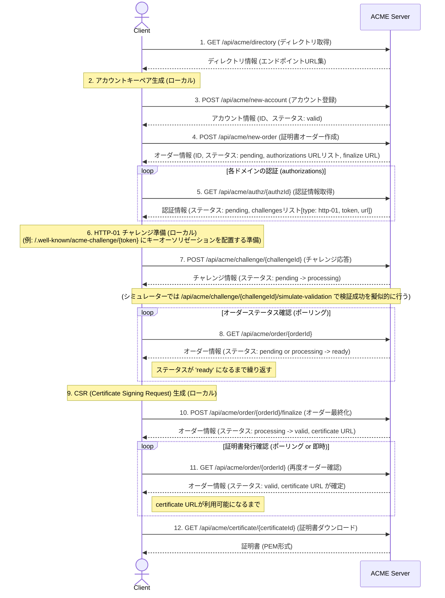

# Day 46 - ACME CA Simulator

これは、ACME (Automated Certificate Management Environment) プロトコル (RFC 8555) の主要なフローを体験するためのシミュレーションアプリケーションです。
認証局 (CA) サーバーのAPIと、証明書発行をリクエストするクライアントのUIを提供します。

https://github.com/user-attachments/assets/b8832653-33da-4511-bfcf-f7aaa3526f91

[100日チャレンジ day46](https://zenn.dev/gin_nazo/scraps/a7269d7c6a528f)

## 概要

Let's Encrypt に代表されるように、ACMEプロトコルはSSL/TLS証明書の取得と更新を自動化するための標準的な方法です。
このアプリケーションは、ACMEプロトコルの複雑な対話を簡略化し、以下のステップをブラウザ上でインタラクティブに体験できるように設計されています。

- アカウントキーペアの生成
- ACMEアカウントの登録
- 証明書発行オーダーの作成
- ドメイン認証チャレンジ (HTTP-01) の準備と通知
- オーダーの最終化と証明書の取得

## 主な機能

- **ACMEサーバーAPI**:
    - ディレクトリ (`/api/acme/directory`): 各種エンドポイントURLを提供します。
    - 新規アカウント作成 (`/api/acme/new-account`): アカウントキーペアに基づいてアカウントを登録します。
    - 新規オーダー作成 (`/api/acme/new-order`): 指定されたドメインに対する証明書発行オーダーを作成します。
    - 認証情報取得 (`/api/acme/authz/:authzId`): オーダーに含まれる各ドメインの認証情報を返します。
    - チャレンジ応答 (`/api/acme/challenge/:challengeId`): クライアントからのチャレンジ完了通知を受け付け、検証を試みます。
    - チャレンジ検証シミュレーション (`/api/acme/challenge/:challengeId/simulate-validation`): HTTP-01チャレンジの検証成功を擬似的に行います（ファイル配置は不要）。
    - オーダー最終化 (`/api/acme/order/:orderId/finalize`): CSRを送信し、証明書発行を要求します。
    - 証明書ダウンロード (`/api/acme/certificate/:certId`): 発行された証明書をダウンロードします。
- **ACMEクライアントUI**:
    - 上記ACMEフローをステップバイステップで実行できるインタラクティブなUI。
    - 各ステップでのリクエスト内容 (JWS) やレスポンス、発行された証明書などを表示します。
    - 秘密鍵やCSRはクライアントサイドで（シミュレーションとして）生成されます。
- **証明書管理UI (CA側)**:
    - `/ca/certificates`: 発行済みの証明書（手動発行とACME発行の両方）の一覧を表示します。

## デザイン

- **モダンミニマリズム**: クリーンで直感的なインターフェースを目指し、Tailwind CSS を使用してミニマルなデザインを採用しています。
- **レスポンシブデザイン**: 様々な画面サイズに対応します。

## 使用技術

- **フレームワーク**: Next.js (App Router)
- **言語**: TypeScript
- **データベース**: SQLite
- **DBアクセス**: better-sqlite3
- **API実装**: Next.js Route Handlers
- **スタイリング**: Tailwind CSS
- **コード品質**: Biome

## ACMEプロトコルフローの主要ステップ (本アプリでのシミュレーション)

1.  **キーペア生成**: クライアントはまず、ACMEアカウントに使用するキーペア（公開鍵と秘密鍵）を生成します。
2.  **アカウント登録**: 生成した公開鍵を使って、CAにアカウントを登録します。CAはアカウントIDを発行します。
3.  **オーダー作成**: クライアントは証明書を発行したいドメイン名を指定し、CAにオーダーを作成します。CAはオーダーURL、最終化URL、および認証が必要なドメインごとの認証情報URLを返します。
4.  **認証情報取得とチャレンジ準備**: クライアントは各認証情報URLからチャレンジの詳細（例: HTTP-01チャレンジのトークン）を取得します。
    - **HTTP-01チャレンジ**: クライアントは `http://<ドメイン名>/.well-known/acme-challenge/<トークン>` というURLで、指定されたキーオーソリゼーションをホストする準備をします。
    - 本シミュレーターでは、実際にファイルを配置する代わりに「検証成功をシミュレート」ボタンでこのステップを代替します。
5.  **チャレンジ応答**: クライアントは、チャレンジの準備ができたことをCAのチャレンジURLに通知します。CAはドメインの所有権を確認するために検証を行います。
6.  **オーダーステータス確認**: クライアントはオーダーのステータスをポーリングします。チャレンジが成功すると、オーダーステータスは `ready` になります。
7.  **オーダー最終化**: クライアントはCSR (Certificate Signing Request) を作成し、CAの最終化URLに送信します。
8.  **証明書ダウンロード**: オーダーが `valid` になると、CAは証明書を発行し、証明書ダウンロードURLを提供します。クライアントはそのURLから証明書をダウンロードします。

### シーケンス図



## 起動方法

1.  リポジトリをクローンします。
2.  `day46_acme_ca_simulator` ディレクトリに移動します。
    ```bash
    cd day46_acme_ca_simulator
    ```
3.  依存関係をインストールします。
    ```bash
    npm install
    ```
4.  開発サーバーを起動します。
    ```bash
    npm run dev -- -p 3001
    ```
5.  ブラウザで `http://localhost:3001` にアクセスします。

## 注意事項

- 本アプリケーションはACMEプロトコルの学習とシミュレーションを目的としており、実際の証明書発行機能やセキュアな鍵管理は行っていません。
- 生成される鍵や証明書はデモ用であり、実際のセキュリティ用途には使用できません。

---
© 2025 lirlia
