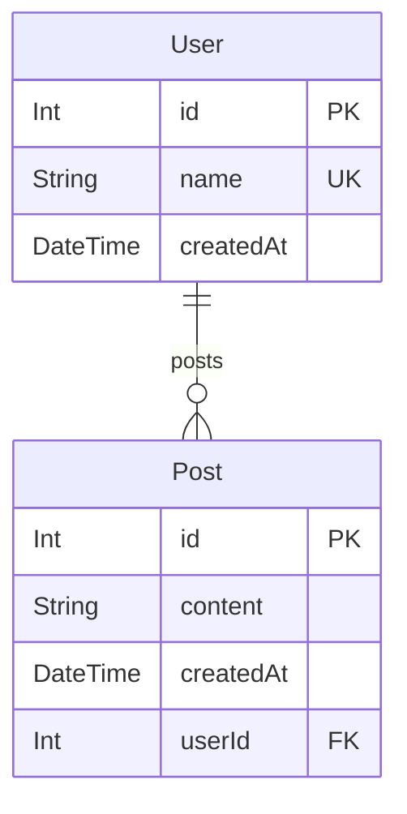
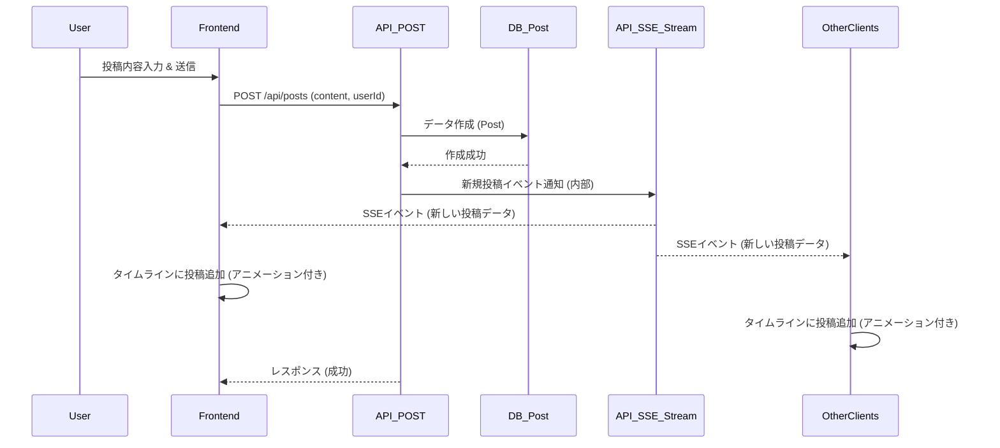

# day4: タイムラインSNS

このプロジェクトは [Next.js](https://nextjs.org) (App Router)、TypeScript、Prisma、SQLite を使用した100日チャレンジ用のタイムラインSNSアプリケーションです。

## アプリケーション概要

X (旧Twitter) のようなシンプルなタイムライン形式のSNSを作成します。

## 機能一覧

- **投稿機能:** ユーザーは短いテキストメッセージを投稿できます。
- **タイムライン表示:** 投稿されたメッセージが新しい順に一覧表示されます。
- **ユーザー切り替え:** 複数の仮ユーザーを簡単に切り替えられます。
- **自動投稿機能 (開発用):** 約5秒ごとにランダムなユーザーとして投稿を自動生成します。
- **タイムラインアニメーション:** 新規投稿が追加される際にアニメーションが適用されます。
- **リアルタイム更新:** Server-Sent Events (SSE) を利用してタイムラインをリアルタイムに更新します。

## ER図



## シーケンス図 (投稿フロー)



## データモデル

- **User**: ユーザー情報を格納します。
  - `id`: ユーザーID
  - `name`: ユーザー名 (一意)
  - `createdAt`: 作成日時
- **Post**: 投稿情報を格納します。
  - `id`: 投稿ID
  - `content`: 投稿内容
  - `createdAt`: 作成日時
  - `userId`: 投稿したユーザーのID

## 画面構成

- **トップページ (`/`)**:
  - ユーザー選択ドロップダウン
  - 投稿フォーム
  - リアルタイム更新されるタイムライン

## 使用技術スタック

- フレームワーク: Next.js (App Router)
- 言語: TypeScript
- DB: SQLite
- ORM: Prisma
- API実装: Next.js Route Handlers
- スタイリング: Tailwind CSS
- リアルタイム通信: Server-Sent Events (SSE)
- パッケージ管理: npm
- コード品質: Biome (Lint & Format)

## 開始方法

1. **依存パッケージをインストール** (完了済み)
   ```bash
   npm install
   ```

2. **データベースの準備**
   ```bash
   # スキーマ定義後
   npx prisma migrate deploy
   # (任意) 初期データ投入
   # npx prisma db seed (※ seed スクリプトを作成した場合)
   ```

3. **開発サーバーを起動**
   ```bash
   npm run dev
   ```
   ブラウザで [http://localhost:3001](http://localhost:3001) を開くと結果が表示されます。

## 注意事項

- このテンプレートはローカル開発環境を主眼としています。
- 本番デプロイには追加の考慮が必要です。
- エラーハンドリングやセキュリティは簡略化されています。
- 将来的な拡張機能 (フォロー、画像投稿、いいね等) を考慮し、拡張しやすい構造を目指します。

## 要件

1.  **基本機能:**
    *   **投稿機能:** ユーザーは短いテキストメッセージを投稿できます。
    *   **タイムライン表示:** 投稿されたメッセージが新しい順に一覧表示されます。
    *   **ユーザー切り替え:** 複数の仮ユーザーを簡単に切り替えられる機能を用意します (認証代わり)。
    *   **自動投稿機能 (開発用):** フロントエンドから約5秒ごとにランダムなユーザーとして投稿を自動生成します。
    *   **タイムラインアニメーション:** 新規投稿がタイムラインに追加される際に、上から下へ流れるようなアニメーションを追加します。

2.  **データモデル (`prisma/schema.prisma`):**
    *   **`User`**:
        *   `id`: Int (Auto Increment, Primary Key)
        *   `name`: String (Unique)
        *   `createdAt`: DateTime (Default: now())
        *   `posts`: `Post[]` (Relation)
    *   **`Post`**:
        *   `id`: Int (Auto Increment, Primary Key)
        *   `content`: String
        *   `createdAt`: DateTime (Default: now())
        *   `userId`: Int (Foreign Key to `User`)
        *   `user`: `User` (Relation)
        *   *(拡張性考慮: 将来的に `isVisible` boolean フィールドなどを追加する可能性)*

3.  **APIエンドポイント (`app/api/.../route.ts`):**
    *   `GET /api/users`: 全てのユーザーを取得します (ユーザー切り替え用)。
    *   `GET /api/posts`: 全ての投稿を新しい順に取得します。*(拡張性考慮: 将来的にフォローしているユーザーや特定の条件でフィルタリングできるように)*
    *   `POST /api/posts`: 新しい投稿を作成します。リクエストボディに `{ "content": "...", "userId": 1 }` の形式でデータを含めます。
    *   `GET /api/posts/stream`: (SSE) 新しい投稿をリアルタイムにクライアントにプッシュします。

4.  **UI (`app/(pages)/`):**
    *   **トップページ (`/`):**
        *   ユーザーを選択するためのドロップダウンまたはボタン。
        *   テキストを入力して投稿するためのフォーム。
        *   全ユーザーの投稿を時系列（新しい順）で表示するタイムライン。
            *   新規投稿はServer-Sent Events (SSE) を利用してリアルタイムに受信し、アニメーション付きで表示します。

5.  **技術スタック:**
    *   Next.js (App Router)
    *   TypeScript
    *   SQLite (Prisma)
    *   Tailwind CSS
    *   Server-Sent Events (SSE)

## 将来的な拡張機能 (考慮点)

*   **フォロー/フォロワー機能:**
    *   `User` モデル間にリレーションを追加。
    *   タイムライン取得API (`GET /api/posts`) でフォロー中のユーザーの投稿のみを表示するフィルタリングロジックを追加できるようにする。
    *   (今回の実装) `Post` モデルやAPIの基本構造は、この拡張に対応しやすいように設計します。
*   **画像投稿:**
    *   `Post` モデルに `imageUrl` 等のフィールドを追加できるようにする。
*   **いいね、リツイート機能:**
    *   `Like`, `Retweet` モデルと関連リレーションを追加できるようにする。

## 起動方法

```bash
npm run dev
```

サーバーは `http://localhost:3001` で起動します。 
