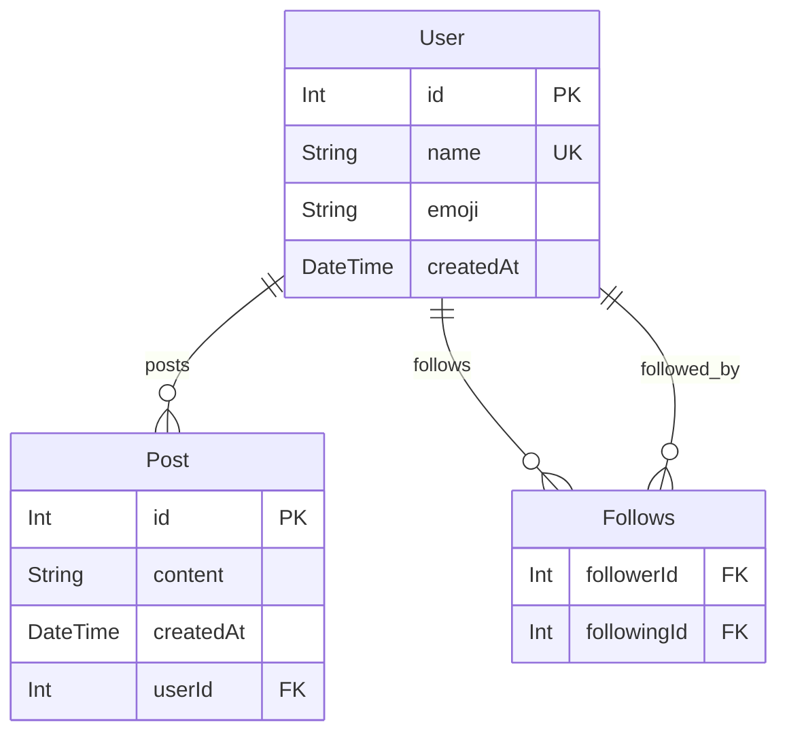
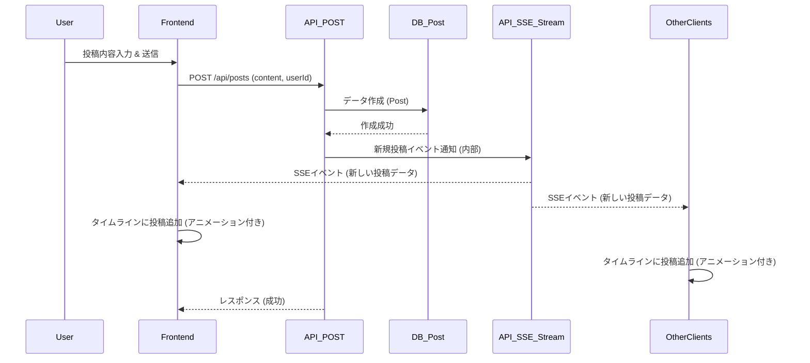

# day4: タイムラインSNS

このプロジェクトは [Next.js](https://nextjs.org) (App Router)、TypeScript、Prisma、SQLite を使用した100日チャレンジ用のタイムラインSNSアプリケーションです。

## アプリケーション概要

X (旧Twitter) のようなシンプルなタイムライン形式のSNSを作成します。

## 機能一覧

- **投稿機能:** ユーザーは短いテキストメッセージを投稿できます。
- **タイムライン表示:** 投稿されたメッセージが新しい順に一覧表示されます。
- **ユーザー切り替え:** 複数の仮ユーザーを簡単に切り替えられます。
- **自動投稿機能 (開発用):** 約5秒ごとにランダムなユーザーとして投稿を自動生成します。
- **タイムラインアニメーション:** 新規投稿が追加される際にアニメーションが適用されます。
- **リアルタイム更新:** Server-Sent Events (SSE) を利用してタイムラインをリアルタイムに更新します。
- **フォロー/フォロー解除機能:** 他のユーザーをフォロー/フォロー解除できます。
- **フォロー中タイムライン:** フォローしているユーザーの投稿のみを表示できます。
- **カーソルベースページネーション:** 効率的なデータロード用のカーソルベースページネーション。
- **ユーザー絵文字:** 各ユーザーを識別するためのランダム絵文字が表示されます。

## リアルタイム更新システムの実装

このアプリケーションでは、リアルタイムなタイムライン更新を実現するために、Server-Sent Events (SSE) と通常のHTTP POSTリクエストを組み合わせたアーキテクチャを採用しています。

### SSEとPOSTの連携フロー

1. **投稿作成プロセス:**
   - ユーザーが投稿フォームから内容を送信すると、フロントエンドから `/api/posts` へPOSTリクエストが送信されます
   - サーバー側では投稿をデータベースに保存し、同時にグローバルなイベントエミッター（Node.jsの`EventEmitter`）を通じて「新規投稿」イベントを発火します
   - SSEエンドポイント（`/api/posts/stream`）がこのイベントをリッスンしており、接続中の全クライアントに新規投稿データをプッシュします

2. **SSEコネクション管理:**
   - ページロード時に各クライアントは `/api/posts/stream` へSSE接続を確立します
   - この接続は維持され続け、サーバーから新しい投稿データがプッシュされるのを待ちます
   - 接続状態はフロントエンドUIに表示され、ユーザーは接続状況を確認できます

3. **クライアント側の実装:**
   - フロントエンドでは `SSEListener` クラスがSSE接続の管理を担当します
   - 新規投稿イベントを受信すると、React状態を更新してタイムラインに新しい投稿を追加します
   - フォロー中タイムライン表示時には、受信した投稿のユーザーIDがフォロー中ユーザーかどうかをチェックし、関連する投稿のみを表示します

### 実装の特徴

- **シングルトンパターン:** `SSEListener` はシングルトンとして実装され、アプリケーション全体で一つのSSE接続を共有します
- **イベントバブリング:** サーバー側では `EventEmitter` を使用して内部的なイベントバブリングを実現し、異なるAPIエンドポイント間でイベントを共有します
- **最適化された状態更新:** 新規投稿受信時には、既存の投稿配列を完全に置き換えるのではなく、先頭に新しい投稿を追加する形で状態を更新します
- **コンポーネント間のイベント共有:** `Timeline` コンポーネントは、SSEからのイベントを受け取り、適切なアニメーションと共に表示します

### コード例: SSEリスナーの実装 (lib/sse.ts)

```typescript
// シングルトンSSEリスナークラス
export class SSEListener {
  private static instance: SSEListener | null = null;
  private eventSource: EventSource | null = null;
  private listeners: Map<string, Set<Function>> = new Map();

  private constructor() {
    // ...初期化処理
  }

  public static initialize(): SSEListener {
    if (!SSEListener.instance) {
      SSEListener.instance = new SSEListener();
      SSEListener.instance.connect();
    }
    return SSEListener.instance;
  }

  private connect(): void {
    this.eventSource = new EventSource('/api/posts/stream');
    // ...イベントハンドラの設定
  }

  // イベントリスナーの追加
  public on(event: string, callback: Function): void {
    // ...リスナー登録ロジック
  }

  // イベントリスナーの削除
  public off(event: string, callback: Function): void {
    // ...リスナー削除ロジック
  }
}
```

### サーバー側実装 (app/api/posts/stream/route.ts)

サーバー側では、Node.jsのEventEmitterを利用して新しい投稿情報を各SSE接続にブロードキャストします。POST APIエンドポイントから投稿が作成されると、このエミッターを通じてSSEストリームに通知されます。

### フォロー/フォロー解除とSSEの連携

フォロー機能の実装においても、SSEシステムと連携しています：

1. ユーザーがフォロー/フォロー解除を行うと、フロントエンドの状態が更新されます
2. タイムラインのタブが「フォロー中」の場合、SSEから受信する新規投稿は「フォローしているユーザー」のフィルタを通過した場合のみ表示されます
3. このフィルタリングは、フロントエンドの `followingIdsSet` を用いてクライアント側で行われ、サーバーへの追加リクエストを最小限に抑えます

この設計により、リアルタイム性と効率性を両立したタイムライン更新システムを実現しています。

## ER図



## シーケンス図 (投稿フロー)



## 使用技術スタック

- フレームワーク: Next.js (App Router)
- 言語: TypeScript
- DB: SQLite
- ORM: Prisma
- API実装: Next.js Route Handlers
- スタイリング: Tailwind CSS
- リアルタイム通信: Server-Sent Events (SSE)
- パッケージ管理: npm
- コード品質: Biome (Lint & Format)

## 開始方法

1. **依存パッケージをインストール** (完了済み)
   ```bash
   npm install
   ```

2. **データベースの準備**
   ```bash
   # スキーマ定義後
   npx prisma migrate deploy
   # (任意) 初期データ投入
   # npx prisma db seed (※ seed スクリプトを作成した場合)
   ```

3. **開発サーバーを起動**
   ```bash
   npm run dev
   ```
   ブラウザで [http://localhost:3001](http://localhost:3001) を開くと結果が表示されます。

## 注意事項

- このテンプレートはローカル開発環境を主眼としています。
- 本番デプロイには追加の考慮が必要です。
- エラーハンドリングやセキュリティは簡略化されています。
- 将来的な拡張機能 (フォロー、画像投稿、いいね等) を考慮し、拡張しやすい構造を目指します。
