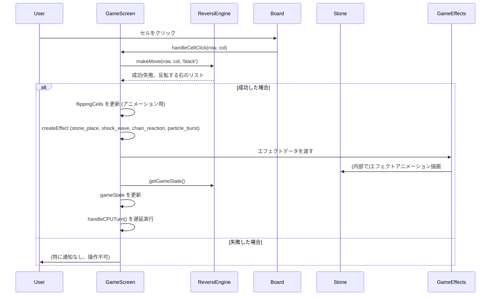

# Day54 - 派手派手オセロバトル

このプロジェクトは [Next.js](https://nextjs.org) (App Router)、TypeScript、SQLite を使用した100日チャレンジの Day54 プロジェクトです。テーマは「派手派手オセロバトル」で、ネオンスタイルのUIと3D風の石、そしてインタラクティブなアニメーションを持つリバーシ（オセロ）ゲームを実装しました。

https://github.com/user-attachments/assets/3b8785da-4e70-4990-ba0e-e960951c596c

[100日チャレンジ day54](https://zenn.dev/gin_nazo/scraps/4a730a1a1cb33f)

## アプリケーション概要

- 近未来的なネオンスタイルのリバーシ（オセロ）ゲーム。
- プレイヤー（黒石）とCPU（白石）が対戦します。
- 石の配置、反転、ゲームの進行に合わせて様々なアニメーションとエフェクトが発生します。
- 3D風の石が盤面上を動き、ゲームを盛り上げます。

## 機能一覧

- **リバーシ（オセロ）の基本ロジック**:
    - 石の配置、反転処理。
    - 有効手の判定と表示（プレイヤーのみ）。
    - CPUの思考ロジック（ランダムな有効手に配置）。
    - 勝敗判定。
- **UI/UX**:
    - ネオンスタイルのゲームボードとUIコンポーネント。
    - 3D風の石デザインとアニメーション。
    - 石の配置時、反転時、ゲーム終了時のアニメーション。
    - プレイヤーとCPUのスコア表示。
    - 現在のターン表示。
    - ゲームオーバー時の結果表示とリスタート機能。
    - タイトル画面とゲーム画面の切り替え。
- **アニメーションとエフェクト**:
    - Framer Motion を活用したインタラクティブなアニメーション。
    - 石が配置される際の衝撃波エフェクト。
    - 石が反転する際の連鎖反応エフェクト。
    - 多数の石が反転する際のパーティクルバーストエフェクト。
    - 石のホバーエフェクト、クリックエフェクト。
    - (当初、さらに派手なエフェクト（メガ爆発、稲妻、画面フラッシュ等）を試みましたが、ゲームプレイとのバランスを考慮し、より洗練された形に調整しました。)

## ER図

本プロジェクトではデータベースを使用していません。ゲームの状態はクライアントサイドで管理されます。

## シーケンス図 (プレイヤーの手番)



## データモデル

- **`GameState`**: ゲーム全体の状態を管理します。
    - `board`: 8x8の盤面。各セルは `'empty'`, `'black'`, `'white'` のいずれか。
    - `currentPlayer`: 現在の手番のプレイヤー (`'black'` または `'white'`)。
    - `blackCount`: 黒石の数。
    - `whiteCount`: 白石の数。
    - `validMoves`: 現在のプレイヤーが配置可能な手のリスト。
    - `gameOver`: ゲームが終了したかどうか。
    - `winner`: 勝者 (`'black'`, `'white'`, `'draw'`)。
- **`EffectData`**: ゲームエフェクトの種類、位置、色などを定義します。

## 画面構成

- **タイトル画面 (`HomePage` - `app/page.tsx` の一部として実装)**:
    - ゲームのタイトル「REVERSI BATTLE」を表示。
    - 「GAME START」ボタンでゲーム画面へ遷移。
    - (設定ボタン、ルールボタンはUIのみで機能は未実装)
- **ゲーム画面 (`GameScreen` - `app/components/GameScreen.tsx`)**:
    - **ゲームヘッダー**: タイトルと「BACK TO TITLE」ボタン。
    - **ゲーム情報パネル (`GameInfo`)**: プレイヤーとCPUのスコア、現在のターン、ゲームオーバー時のメッセージ、リスタートボタン。
    - **ゲームボード (`Board`)**: 8x8の盤面。
        - **セル (`Cell`)**: 各マス。クリック可能。
        - **石 (`Stone`)**: 3D風の石。配置、反転アニメーション。
    - **ゲームエフェクト表示レイヤー (`GameEffects`)**: 石の配置や反転に伴う視覚エフェクトを表示。

## 使用技術スタック

- フレームワーク: Next.js 15.3.0 (App Router, Turbopack)
- 言語: TypeScript
- スタイリング: Tailwind CSS
- アニメーション: Framer Motion
- ゲームロジック: `lib/reversi-engine.ts` (独自実装)
- 状態管理: React Hooks (`useState`, `useCallback`, `useEffect`)
- コード品質: Biome (Lint & Format)

## 開始方法

1. **依存パッケージをインストール**
   ```bash
   npm install
   ```

2. **開発サーバーを起動**
   ```bash
   npm run dev -- --port 3001
   ```
   ブラウザで [http://localhost:3001](http://localhost:3001) を開くとゲームが開始されます。

## 注意事項

- 本プロジェクトはデータベースを使用せず、状態はクライアントサイドで完結しています。
- CPUのAIは非常にシンプルなものです（ランダムな有効手に配置）。
- エフェクトの調整は継続的に行われる可能性があります。

## Day54 での主な作業内容
- **UIレイアウト調整**:
    - `GameScreen.tsx`: ヘッダーレイアウトを2段にし、「BACK TO TITLE」ボタンとタイトルが重ならないように修正。
    - `GameInfo.tsx`: プレイヤー情報表示を縦並びに変更し、スコア表示と石のアイコンが重ならないように修正。ターンインジケーターの高さ固定。
- **3Dストーン表現の強化**:
    - `Stone.tsx`: `transform-style: preserve-3d` を使用し、石の前面・背面に異なるグラデーションを適用。ホバー時や反転時に3D的な回転アニメーションを実装。厚み表現は試行錯誤の末、簡略化しつつ視覚効果を維持。
- **UIクリーンナップ**:
    - `GameInfo.tsx`: プレイヤー/CPU情報セクションから石のアイコンを削除し、スコア表示を大きくしてシンプル化。
- **演出の派手化の試み (一部元に戻し)**:
    - `GameEffects.tsx`, `GameScreen.tsx`: 当初、メガ爆発、稲妻、画面全体のフラッシュ、渦巻きなどの新しいエフェクトタイプを多数追加し、既存エフェクトも大幅に強化。スクリーンシェイクなども試みました。
    - しかし、過度なエフェクトはゲームプレイの見通しを悪くする可能性や、パフォーマンスへの影響を考慮し、最終的にはDay53時点の比較的洗練されたエフェクト群に戻し、安定性と視認性を優先しました。`EffectData` 型定義も元に戻しています。
    - 石の配置時や大量反転時のエフェクトは、`GameScreen.tsx`内で条件分岐により多少派手になるように調整しています。
- **背景エフェクトの追加**:
    - `app/page.tsx`: タイトル画面の背景に、動的なグラデーション、浮遊するパーティクル、回転するネオンリング、グリッドラインなどの派手なエフェクトを追加。

(C) 2024 Lirlia
