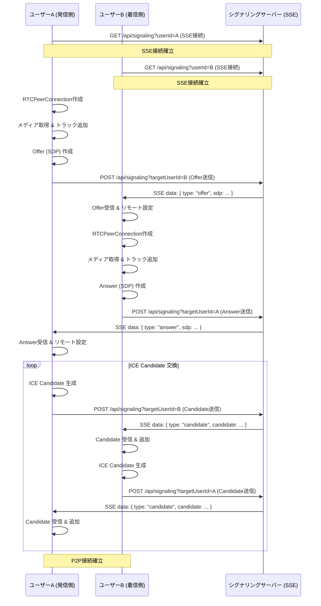

# 100日チャレンジ - day5: WebRTC 動画チャットアプリ

このプロジェクトは [Next.js](https://nextjs.org) (App Router)、TypeScript、WebRTC を使用した100日チャレンジの5日目、シンプルな1対1ビデオチャットアプリです。

## アプリケーション概要

ユーザー同士が 1 対 1 でリアルタイムにビデオ通話を行えるシンプルな Web アプリケーションです。WebRTC を利用して P2P でメディアストリームを交換し、シグナリングには Server-Sent Events (SSE) を使用します。

## 機能一覧

- **1対1ビデオ通話**: 2人のユーザー間で映像と音声を送受信できます。
- **ユーザー識別**: 各ユーザーはシンプルなユーザーIDで識別されます（ログイン機能は不要）。
- **接続開始**: ユーザーは通話したい相手のユーザーIDを指定して接続を開始します。
- **リアルタイム通信**: WebRTC (RTCPeerConnection) を利用して、P2P (Peer-to-Peer) でメディアストリームを交換します。
- **シグナリング**: 通話の接続確立に必要な情報 (SDP Offer/Answer, ICE Candidate) を交換するために、サーバー (Next.js Route Handler) を介したシグナリングを行います。

## 画面構成

- **トップページ (`/`)**:
    - 自分のユーザーIDを入力する欄。
    - 通話したい相手のユーザーIDを入力する欄。
    - 「通話開始」ボタン。
- **チャットページ (`/chat?userId=[自分のID]&peerId=[相手のID]`)**:
    - 自分のビデオ映像を表示する `<video>` 要素。
    - 相手のビデオ映像を表示する `<video>` 要素。
    - 接続状態を示すシンプルな表示。
    - 「通話終了」ボタン。

## シグナリングフロー (シーケンス図)



## 開始方法

1. **依存パッケージをインストール**
   ```bash
   npm install
   ```

2. **開発サーバーを起動**
   ```bash
   npm run dev
   ```
   ブラウザで [http://localhost:3001](http://localhost:3001) を開くと結果が表示されます。

## 注意事項

- このテンプレートはローカル開発環境を主眼としています。
- 本番デプロイには追加の考慮が必要です。
- エラーハンドリングやセキュリティは簡略化されています。
- シグナリングサーバーはメモリ上でクライアントを管理するため、サーバーを再起動すると接続情報が失われます。
- TURNサーバーを実装していないため、特定のネットワーク環境下では接続できない場合があります。
