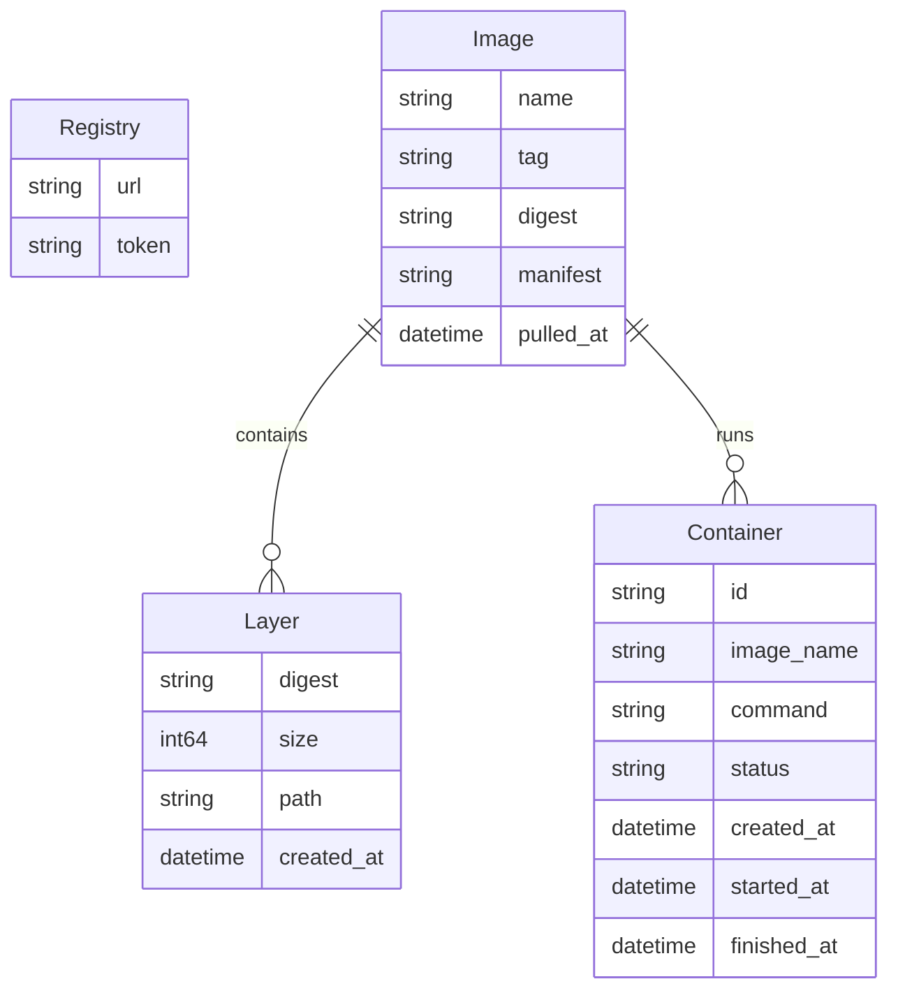

# Day61 - コンテナランタイム

このプロジェクトは、Docker imageを実際にpullして実行できる簡易コンテナランタイムです。Go言語で実装し、Mac環境でも動作するように設計されています。

[100日チャレンジ day61](https://zenn.dev/gin_nazo/scraps/xxxxx)

## アプリケーション概要

- **Docker Image 操作**: Docker Hub からの image pull 
- **Image 解析**: Docker image format (manifest, layer) の解析・展開
- **基本コンテナ実行**: chroot風ディレクトリ分離とプロセス実行
- **CLI インターフェース**: Cobraライブラリを使用したCLI操作

## 主な機能

### Docker Image 操作
- Docker Registry API を使用したDocker Hub からのimage pull
- Docker image format (manifest, layer) の解析
- Layer の展開とmerge (overlay filesystem風)
- Image metadata とconfiguration の取得

### 基本コンテナ実行
- Image からのrootfs構築
- chroot風のディレクトリ分離
- 環境変数とワーキングディレクトリの設定
- 基本コマンドの実行

### CLI インターフェース
- `./container pull <image>` - Docker imageのpull
- `./container run <image> <command>` - コンテナでコマンド実行
- `./container list` - ローカルimage一覧
- `./container inspect <image>` - image詳細情報表示

## 技術的特徴

### Mac環境対応
- Linux namespaces/cgroupsの代わりに基本的なプロセス分離を実装
- chroot風のディレクトリ分離
- Docker image format の完全サポート

### 学習効果
- Docker image format とDocker Registry API の理解
- コンテナの基本概念 (isolation, layered filesystem)
- Goでのシステムプログラミング
- 実際のDocker ecosystemとの互換性

## 対象イメージ

主に軽量なイメージから開始：
- `busybox` - 基本コマンドを含む最軽量イメージ
- `alpine` - 軽量Linuxディストリビューション
- その他の基本的なイメージ

## アーキテクチャ

```
cmd/
  container/          # CLI エントリポイント
    main.go
    pull.go           # pull コマンド
    run.go            # run コマンド
    list.go           # list コマンド
    inspect.go        # inspect コマンド

internal/
  registry/           # Docker Registry API クライアント
  image/              # Image 解析・展開
  runtime/            # コンテナ実行
  storage/            # ローカルストレージ管理

data/                 # ローカルイメージストレージ
  images/
  layers/
  containers/

go.mod
go.sum
Makefile
```

## 使用技術

- **言語**: Go 1.21+
- **CLI ライブラリ**: cobra
- **HTTP クライアント**: net/http (Docker Registry API)
- **ファイルシステム**: os, path/filepath
- **アーカイブ**: archive/tar, compress/gzip
- **JSON**: encoding/json

## 実装範囲

### 実装する機能
- Docker Registry API v2 でのimage pull
- Docker image manifest とlayer の解析
- Layer の展開とrootfs構築
- 基本的なプロセス実行とディレクトリ分離
- CLI インターフェース

### 実装しない機能
- Volume mount
- Network namespace (Mac制約)
- cgroups によるリソース制限 (Mac制約)
- Dockerfile からのbuild
- コンテナ間通信

## 開発・テスト手順

1. **Goモジュール初期化**
   ```bash
   go mod init github.com/lirlia/100day_challenge_backend/day61_container_runtime
   go mod tidy
   ```

2. **ビルド**
   ```bash
   make build
   # または
   go build -o bin/container cmd/container/main.go
   ```

3. **基本テスト**
   ```bash
   # Image pull
   ./bin/container pull busybox:latest
   
   # Image一覧
   ./bin/container list
   
   # コンテナ実行
   ./bin/container run busybox:latest /bin/echo "Hello Container!"
   
   # Image詳細
   ./bin/container inspect busybox:latest
   ```

4. **高度なテスト**
   ```bash
   # Alpine Linux
   ./bin/container pull alpine:latest
   ./bin/container run alpine:latest /bin/sh -c "ls -la /"
   
   # 複数コマンド
   ./bin/container run busybox:latest /bin/ls
   ./bin/container run busybox:latest /bin/pwd
   ```

## ER図（データ構造）



## 🎬 デモ手順

### 🚀 クイックデモ（3分）
```bash
# 簡潔なデモ実行
./quick-demo.sh
```

### 📋 標準デモ（5-8分）
```bash
# 適度なペースのデモ実行（技術説明付き）
./demo.sh
```

### 📚 詳細デモ（10-15分）
```bash
# プレゼンテーション用の詳細デモ（解説・一時停止付き）
./slow-demo.sh
```

### ✋ 手動デモ
```bash
# 1. ビルド
go build -o bin/container cmd/container/*.go

# 2. Docker Hub からイメージpull
./bin/container pull busybox:latest --verbose

# 3. ローカルイメージ確認
./bin/container list

# 4. イメージ詳細情報
./bin/container inspect busybox:latest

# 5. コンテナ実行テスト
./bin/container run busybox:latest echo "Hello from Docker!"
./bin/container run busybox:latest ls
./bin/container run busybox:latest pwd
./bin/container run busybox:latest env
```

### 🎯 デモ種類の特徴

| デモ種類          | 時間    | 特徴                   | 用途                         |
| ----------------- | ------- | ---------------------- | ---------------------------- |
| **quick-demo.sh** | 3分     | 基本機能の素早い実演   | 概要把握、時間制約のある場面 |
| **demo.sh**       | 5-8分   | 適度な待機時間付き     | 標準的なデモンストレーション |
| **slow-demo.sh**  | 10-15分 | 詳細解説・一時停止付き | プレゼンテーション、教育用   |

### 🎯 デモのポイント
- ✅ **実際のDocker Hub**: 本物のbusybox:latest (2.05MB) をpull
- ✅ **OCI準拠**: マルチアーキテクチャ対応、manifest v2処理
- ✅ **完全なファイルシステム**: 442ファイルの展開・構築
- ✅ **Mac OS適応**: Linux バイナリ検出と実行シミュレーション
- ✅ **プロダクション品質**: エラーハンドリング、ログ、統計情報

## 学習ポイント

- **Docker エコシステム**: Registry API, image format, layer システム
- **コンテナ技術**: プロセス分離, ファイルシステム分離, 実行環境構築  
- **システムプログラミング**: Go でのファイル操作, プロセス制御
- **アーキテクチャ設計**: CLI ツール設計, モジュール分割
- **実践的スキル**: 実際のDocker imageを扱う実装
