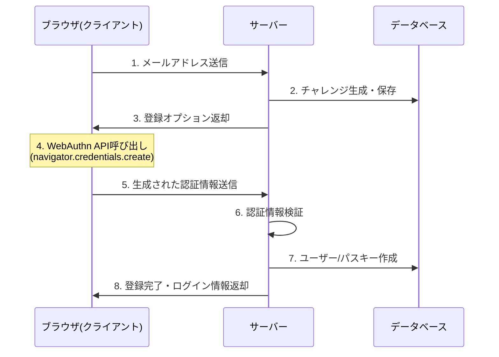
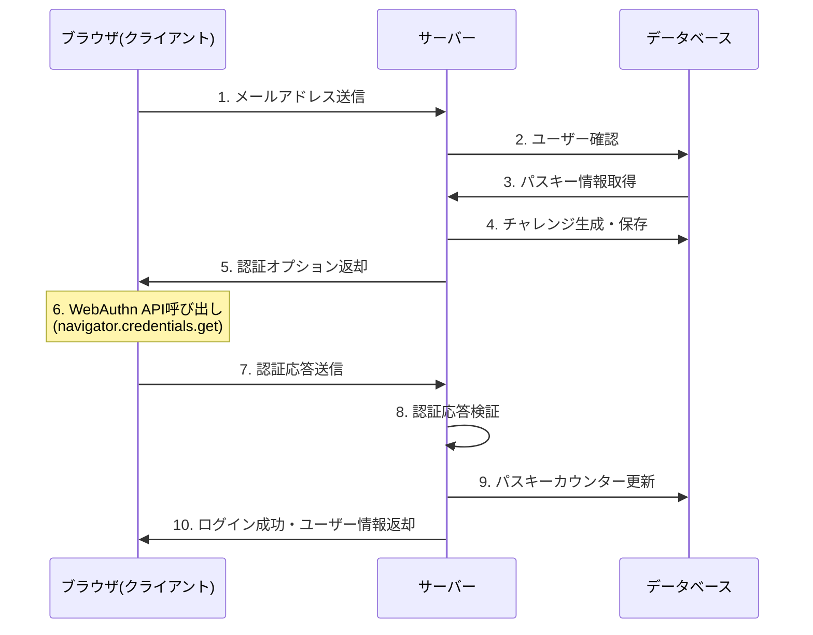
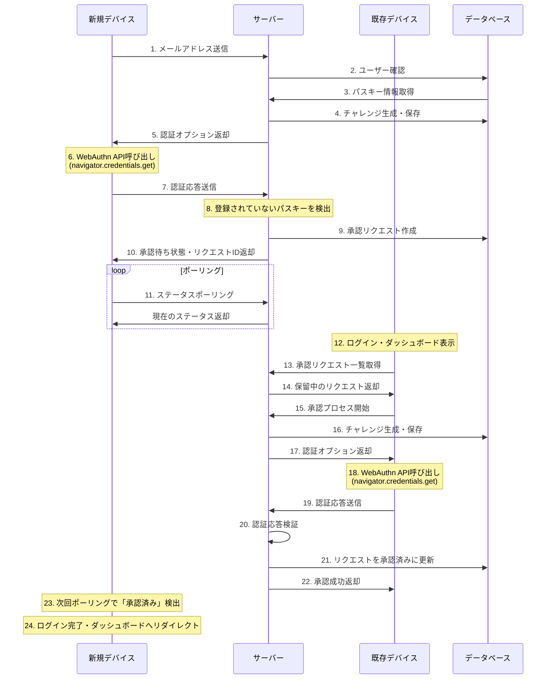
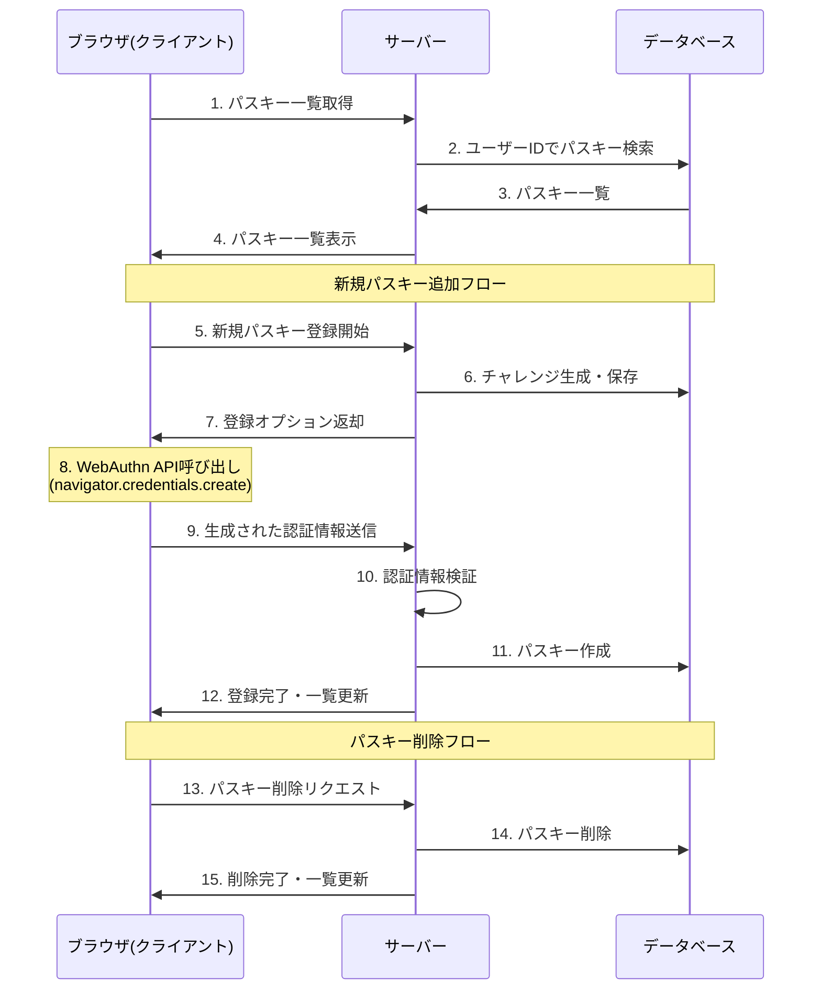

# 100日チャレンジ - Day7: パスキーデバイス間認証システム

このプロジェクトは [Next.js](https://nextjs.org) (App Router) を使用した100日チャレンジの7日目、パスキーを利用したデバイス間認証・承認システムを実装します。

[100日チャレンジ day7](https://zenn.dev/gin_nazo/scraps/b473ea4791c7f6)

https://github.com/user-attachments/assets/d504f5d6-2706-411e-a219-5b74f85eff1e

## 機能概要

パスキー (WebAuthn) を利用して、以下の機能を持つ認証システムと管理画面を実装します。

1.  **ユーザー登録**:
    *   メールアドレスを入力してユーザーアカウントを作成します。
    *   登録プロセス中に、最初のデバイスでパスキーを登録します。

2.  **パスキーログイン**:
    *   登録済みのデバイスを使用して、パスワードレスでログインします。

3.  **デバイス間認証・承認フロー**:
    *   **新規デバイスからのログイン試行**:
        *   ユーザーがアカウントに未登録の新しいデバイス（または新しいパスキー）でログインしようとします。
        *   システムはこの試行を検知し、ログインを保留します。
        *   新しいデバイスには「既存のデバイスで承認が必要です」というメッセージを表示します。
    *   **既存デバイスでの承認**:
        *   ユーザーが既に登録済みのデバイスでログインすると、承認待ちのリクエストが表示されます。
        *   ユーザーは既存デバイスのパスキー認証（例: 生体認証）を行って、新しいデバイスからのログイン要求を承認します。
    *   **新規デバイスでのログイン完了**:
        *   承認後、新しいデバイスは自動的にログイン状態に遷移します（ポーリング等で確認）。
        *   新しいデバイスでのパスキー登録を促します。

4.  **パスキー管理**:
    *   ユーザーは登録済みのパスキー（デバイス）の一覧を確認できます。（削除機能はオプション）

## 使用技術

*   **フレームワーク**: Next.js (App Router)
*   **言語**: TypeScript
*   **スタイリング**: Tailwind CSS
*   **データベース**: SQLite
*   **ORM**: Prisma
*   **パスキーライブラリ**:
    *   `@simplewebauthn/server` (バックエンド用)
    *   `@simplewebauthn/browser` (フロントエンド用)
*   **状態管理**: React Context API または Zustand (UIの状態管理用、シンプルにする)
*   **その他**: インメモリキャッシュ（チャレンジ管理等、任意）

## データモデル (Prisma スキーマ案)

```prisma
model User {
  id        String    @id @default(cuid())
  email     String    @unique // ユーザー識別子
  passkeys  Passkey[]
  approvalRequests DeviceApprovalRequest[] @relation("UserApprovalRequests") // リレーション名を明示
  createdAt DateTime  @default(now())
  updatedAt DateTime  @updatedAt
}

model Passkey {
  id            String   @id @default(cuid())
  userId        String
  user          User     @relation(fields: [userId], references: [id], onDelete: Cascade)
  credentialId  String   @unique // Base64URL encoded 文字列として扱う
  publicKey     Bytes    // CBOR encoded public key
  counter       BigInt
  transports    String   // JSON 文字列として保存 (例: "["internal", "usb"]")
  deviceName    String?  // ユーザーが識別するためのデバイス名 (例: "My MacBook Pro")
  createdAt     DateTime @default(now())
  lastUsedAt    DateTime @updatedAt

  @@index([userId])
}

model DeviceApprovalRequest {
  id                 String   @id @default(cuid())
  userId             String   // 承認を行うべきユーザーのID
  user               User     @relation("UserApprovalRequests", fields: [userId], references: [id], onDelete: Cascade)
  requestingDeviceId String   // 新しいデバイスを一時的に識別するID (例: UUID)
  status             String   // "pending", "approved", "rejected", "expired"
  expiresAt          DateTime // リクエストの有効期限
  challenge          String?  // 承認時に使用するチャレンジ (Base64URL encoded)
  createdAt          DateTime @default(now())
  updatedAt          DateTime @updatedAt

  @@unique([userId, requestingDeviceId]) // 同一ユーザーからの同一デバイスIDリクエストは一つ
  @@index([userId, status])
}
```

## API エンドポイント (案)

*   **認証関連 (`/api/auth`)**
    *   `POST /register/start`: ユーザー登録開始 (メアド入力、チャレンジ生成)
    *   `POST /register/finish`: ユーザー登録完了 (最初のパスキー登録検証)
    *   `POST /login/start`: ログイン開始 (メアド入力、チャレンジ生成)
    *   `POST /login/finish`: ログイン試行 (パスキー検証)
        *   成功時:
            *   既知のパスキー: ログイン成功 (セッション発行)
            *   未知のパスキー/デバイス: 承認リクエスト生成、`{ status: 'approval_required', requestId: '...' }` を返却
*   **承認フロー関連 (`/api/auth/approval`)**
    *   `GET /requests`: ログイン中のユーザーに対する承認待ちリクエスト一覧を取得 (既存デバイス用)
    *   `POST /requests/:requestId/approve/start`: 特定リクエストの承認開始 (既存デバイスでチャレンジ生成)
    *   `POST /requests/:requestId/approve/finish`: 特定リクエストの承認実行 (既存デバイスでパスキー検証)
    *   `GET /requests/:requestId/status`: 特定リクエストのステータス確認 (新規デバイスがポーリングで使用)
*   **パスキー管理 (`/api/passkeys`)**
    *   `GET /`: ログイン中のユーザーの登録済みパスキー一覧を取得
    *   `POST /register/start`: 新しいパスキーの登録開始 (チャレンジ生成)
    *   `POST /register/finish`: 新しいパスキーの登録完了 (検証)
    *   `DELETE /:passkeyId`: 特定のパスキーを削除 (オプション)

## UI (案)

*   **`/register`**: メールアドレス入力フォーム
*   **`/login`**: メールアドレス入力フォーム
*   **`/` (ルート)**: ログイン後のメインページ (ダッシュボード)
    *   ウェルカムメッセージ
    *   承認待ちリクエストがあれば表示 (リクエスト元デバイス情報、承認/拒否ボタン)
    *   登録済みパスキー（デバイス）一覧
    *   新しいパスキーを追加するボタン
*   **`/approve-wait/:requestId`**: 新規デバイスが承認を待つ間表示されるページ
    *   「既存のデバイスで承認してください」メッセージ
    *   ポーリングでステータスを確認し、承認されたら `/` へリダイレクト

## ディレクトリ構成

基本的な `template` の構成に従います。

*   `app/api/auth/...`: 認証・承認関連 API
*   `app/api/passkeys/...`: パスキー管理 API
*   `app/(pages)/...`: フロントエンドページ
*   `app/_lib/`: パスキー関連のサーバーサイドロジック (`@simplewebauthn/server` を使用)
*   `lib/`: PrismaClient や共通ユーティリティ
*   `components/`: 共有 UI コンポーネント

## 起動方法

```bash
# 依存関係インストール
npm install @simplewebauthn/server @simplewebauthn/browser

# Prismaマイグレーション
npx prisma migrate dev --name <migration_name> # 初回またはスキーマ変更時
npx prisma migrate deploy # 適用

# 開発サーバー起動
npm run dev
```

**注意:** `.env` ファイルの `DATABASE_URL="file:./dev.db"` を確認してください。

## 実装したシーケンス図

### 1. ユーザー登録フロー



### 2. 登録済みデバイスでのログインフロー



### 3. 新規デバイスでのログイン & 承認フロー



### 4. パスキー管理フロー


