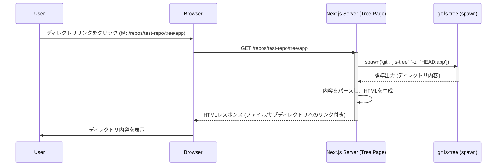
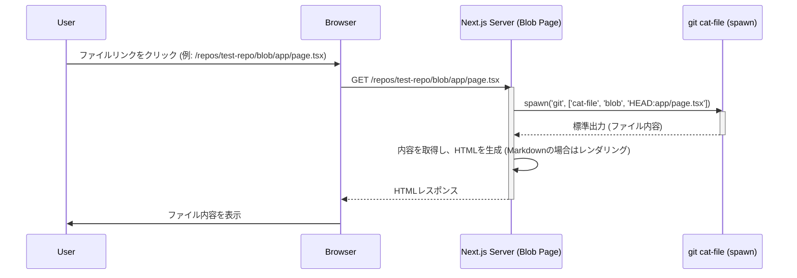
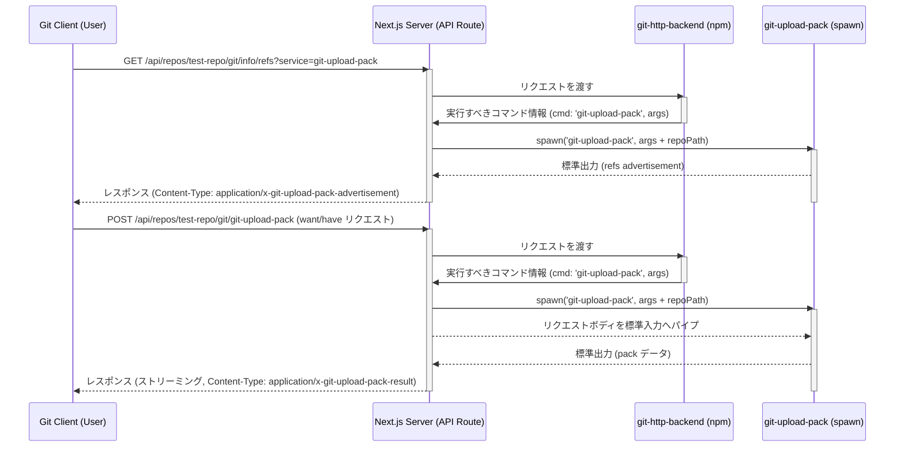
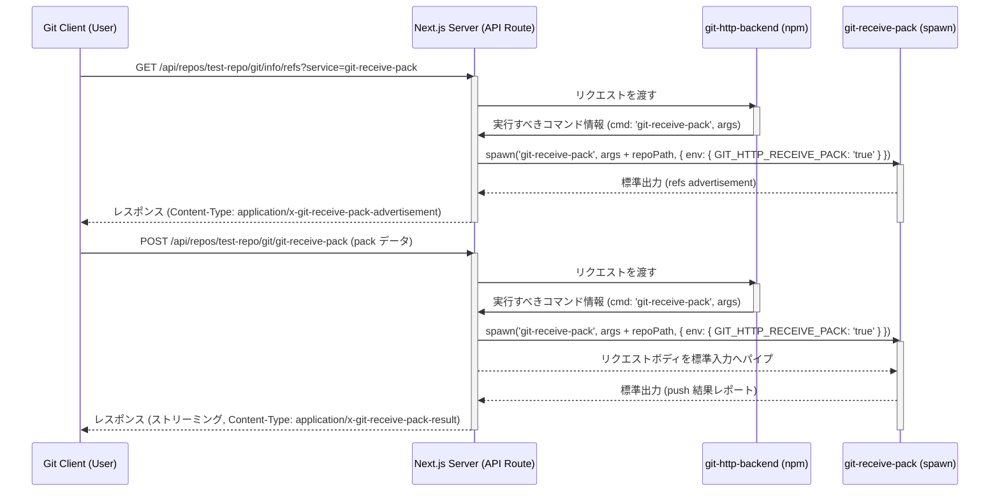

## Day 8: Git リポジトリブラウザ & クローンサーバー 仕様書

### 概要

ローカル環境で動作するシンプルな Git リポジトリのブラウジング機能と、HTTP 経由での `git clone` / `push` 機能を提供する Web アプリケーションを作成します。UI からリポジトリを作成でき、リポジトリ内のファイルやディレクトリを閲覧できます。クローン用のコマンドも表示されます。

[100日チャレンジ day8](https://zenn.dev/gin_nazo/scraps/1cde7e2a535b6d)

https://github.com/user-attachments/assets/de0f64d0-16d9-40bd-b7ab-986c9c26e431

### 機能要件

1.  **リポジトリ作成 (API)**
    *   エンドポイント: `POST /api/repos`
    *   リクエストボディ: `{ "name": "repository-name" }`
    *   処理:
        *   指定された名前でサーバー上に空の bare Git リポジトリ (`.git`) を作成 (`isomorphic-git` の `init`)。場所: `repositories/`。
        *   リポジトリ名とパスをデータベース (SQLite) に保存。
        *   作成されたリポジトリ情報を返す。
    *   バリデーション: リポジトリ名の形式、重複チェック。

2.  **リポジトリ作成 (UI)**
    *   場所: リポジトリ一覧ページ ( `/` )
    *   UI: リポジトリ名を入力するフォームと作成ボタン。
    *   処理: フォーム送信時に `POST /api/repos` を呼び出し、成功したらリポジトリ一覧を更新する。

3.  **リポジトリ一覧表示 (UI)**
    *   ルートパス: `/`
    *   処理: データベースからリポジトリ一覧を取得し、各リポジトリへのリンク (`/repos/[repoName]`) 付きで表示する。リポジトリ作成フォームも同ページに表示する。

4.  **ファイル/ディレクトリ一覧表示 (UI)**
    *   ルートパス: `/repos/[repoName]`
    *   処理:
        *   `isomorphic-git` を使用し、リポジトリのデフォルトブランチのルートディレクトリの内容を取得。
        *   取得した内容をリスト形式で表示（ファイルはファイル内容表示ページへのリンク）。
        *   **クローンコマンド表示:** このリポジトリをクローンするための `git clone http://localhost:3001/api/repos/[repoName]/git` コマンドを表示する。

5.  **ファイル内容表示 (UI)**
    *   ルートパス: `/repos/[repoName]/blob/[...filePath]`
    *   処理:
        *   `isomorphic-git` を使用し、指定されたファイルの内容を取得。
        *   Markdown ファイル (`.md`) は HTML としてレンダリング表示。
        *   その他はプレーンテキストとして表示。

6.  **`git clone` 機能 (API)**
    *   エンドポイント: `GET` および `POST` リクエストを `/api/repos/[repoName]/git/[...gitPath]` で受け付ける。
    *   処理:
        *   npm パッケージ `git-http-backend` を利用。
        *   システムにインストールされている `git http-backend` CGI を呼び出して Smart HTTP プロトコルを処理。
        *   ローカルからの `git clone http://localhost:3001/api/repos/[repoName]/git` を成功させる。
7.  **`git push` 機能 (API)**
    *   エンドポイント: `POST` リクエストを `/api/repos/[repoName]/git/[...gitPath]` で受け付ける。
    *   処理:
        *   npm パッケージ `git-http-backend` を利用。
        *   システムにインストールされている `git http-backend` CGI を呼び出して Smart HTTP プロトコルを処理。
        *   ローカルからの `git push http://localhost:3001/api/repos/[repoName]/git` を成功させる。

### 非機能要件

*   フレームワーク: Next.js (App Router)
*   言語: TypeScript
*   データベース: SQLite (Prisma)
*   スタイリング: Tailwind CSS
*   Git 操作 (UI 用): `isomorphic-git`
*   Git 操作 (Clone 用): `git-http-backend` (npm) + システムの `git`
*   Markdown 描画: `react-markdown` (または `marked`)
*   認証・認可: なし
*   エラーハンドリング: 基本的な `try-catch`, `console.error`
*   テスト: 手動確認 (UI操作, `curl`, `git clone`)

### データベーススキーマ (Prisma)

```prisma
// prisma/schema.prisma
model Repository {
  id        String   @id @default(cuid())
  name      String   @unique
  path      String   @unique
  createdAt DateTime @default(now())
  updatedAt DateTime @updatedAt
}
```

### ディレクトリ構成案 (変更なし)

```
/day8_git_browser
├── app/
│   ├── api/
│   │   ├── repos/
│   │   │   ├── route.ts                     # POST /api/repos (リポジトリ作成 API)
│   │   │   └── [repoName]/
│   │   │       └── git/
│   │   │           └── [...gitPath]/
│   │   │               └── route.ts         # GET, POST /api/repos/[repoName]/git/* (git clone用 API)
│   ├── (pages)/
│   │   ├── repos/
│   │   │   └── [repoName]/
│   │   │       ├── blob/
│   │   │       │   └── [...filePath]/
│   │   │       │       └── page.tsx         # ファイル内容表示 UI
│   │   │       └── page.tsx                 # ファイル/ディレクトリ一覧 & クローンコマンド表示 UI
│   │   └── page.tsx                         # リポジトリ一覧 & 作成フォーム UI (ルート '/' と兼用)
│   ├── layout.tsx
│   └── globals.css
├── components/                              # 共有UIコンポーネント (例: RepoCreateForm)
│   └── ui/
├── lib/
│   ├── db.ts
│   ├── git.ts                             # isomorphic-git ヘルパー
│   └── utils.ts
├── prisma/
│   ├── schema.prisma
│   └── migrations/
├── public/
├── repositories/                          # 作成された bare リポジトリ (.git) 格納場所
├── .env
├── next.config.mjs
├── package.json
├── tsconfig.json
└── README.md
```

### 作業手順案 (UI 追加分を反映)

1.  **プロジェクト初期化:** `template` -> `day8_git_browser`, `package.json` 更新, `README.md` 更新。
2.  **依存関係インストール:** `isomorphic-git`, `@types/isomorphic-git`, `git-http-backend`, `react-markdown`, `@types/react-markdown`。
3.  **リポジトリ保存ディレクトリ作成:** `mkdir repositories`。
4.  **Prisma 設定:** `schema.prisma` 定義, `npx prisma migrate dev --name init`。
5.  **API 実装 (リポジトリ作成):** `/api/repos/route.ts`。
6.  **API 実装 (git clone):** `/api/repos/[repoName]/git/[...gitPath]/route.ts`。
7.  **UI 実装 (リポジトリ一覧 & 作成フォーム):** `/app/page.tsx` と、必要なら `components/RepoCreateForm.tsx`。クライアントコンポーネントでフォーム状態管理と API 呼び出しを行う。
8.  **UI 実装 (ファイル/ディレクトリ一覧 & クローンコマンド):** `/app/(pages)/repos/[repoName]/page.tsx`。`isomorphic-git` でファイル一覧取得、クローンコマンド文字列を表示。
9.  **UI 実装 (ファイル内容表示):** `/app/(pages)/repos/[repoName]/blob/[...filePath]/page.tsx`。
10. **動作確認:** UI 操作、`curl`、`git clone`。

### Git 関連処理の実装詳細

当初、ファイルシステム操作には `isomorphic-git` を利用する計画でしたが、特に Bare リポジトリに対する `ls-tree` (ディレクトリ内容取得) や `cat-file` (ファイル内容取得) の機能実装において、Node.js の `child_process.spawn` を使用して直接システム上の `git` コマンドを実行する方式に変更しました。これは、`isomorphic-git` で Bare リポジトリの特定のディレクトリやファイルにアクセスする際の挙動が不安定であったため、より確実な方法として採用しました。

*   **ディレクトリ内容の取得:**
    *   該当ページの Server Component (`/app/(pages)/repos/[repoName]/page.tsx`, `/app/(pages)/repos/[repoName]/tree/[...dirPath]/page.tsx`) 内で `spawn('git', ['ls-tree', '-z', 'HEAD[:path]'], { cwd: repoPath })` を実行します。
    *   `-z` オプションで NUL 区切りされた標準出力を受け取り、パースしてファイル/ディレクトリのリストを生成します。
    *   `tree` ページでは、カレントディレクトリ (`currentPath`) と `ls-tree` から得られた相対パスを結合して、リポジトリルートからのフルパスを生成し、リンクに使用しています。
*   **ファイル内容の取得:**
    *   該当ページの Server Component (`/app/(pages)/repos/[repoName]/blob/[...filePath]/page.tsx`) 内で `spawn('git', ['cat-file', 'blob', `HEAD:${filePath}`], { cwd: repoPath })` を実行します。
    *   標準出力をファイル内容として取得します。
*   **HTTP 経由の Git 操作 (`clone`/`push`):**
    *   Next.js の Route Handler (`/api/repos/[repoName]/git/[...gitPath]/route.ts`) で実装されています。
    *   npm パッケージ `git-http-backend` を利用しています。このライブラリは、入ってきた HTTP リクエスト (パス、メソッド、クエリパラメータ、ボディ) を解析し、実行すべき Git コマンド (`git-upload-pack` または `git-receive-pack`) とその引数、必要な環境変数を特定します。
    *   Route Handler 内で `spawn` を使用して、`git-http-backend` が特定した Git コマンドを適切な引数と環境変数 (`GIT_PROJECT_ROOT`, `GIT_HTTP_EXPORT_ALL` など、及び `git-receive-pack` 用の `GIT_HTTP_RECEIVE_PACK=true`) 付きで Bare リポジトリのディレクトリ (`repositories/[repoName].git`) を対象に実行します。
    *   クライアントのリクエストボディ (push の場合) を `spawn` した Git プロセスの標準入力に流し込み、Git プロセスの標準出力をクライアントへのレスポンスボディとしてストリーミングで返します。
    *   レスポンスの `Content-Type` ヘッダーは、リクエストパス (`/info/refs`, `/git-upload-pack`, `/git-receive-pack`) とクエリパラメータ (`service=`) から事前に判断して設定しています。

### シーケンス図

#### 1. ディレクトリ/ファイル一覧表示 (Tree Page)



#### 2. ファイル内容表示 (Blob Page)



#### 3. `git clone` (Smart HTTP)



#### 4. `git push` (Smart HTTP)


