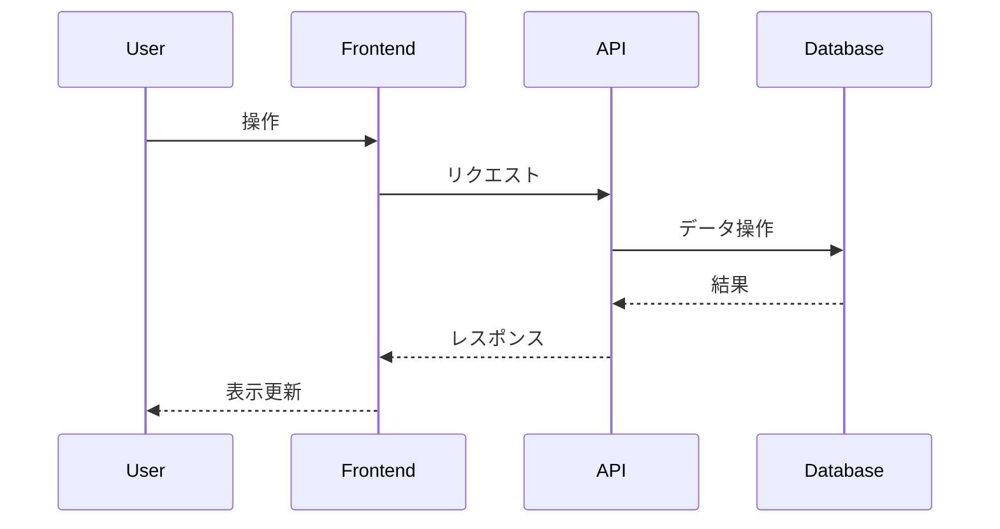

# 100日チャレンジ - Next.js アプリケーションテンプレート

このプロジェクトは [Next.js](https://nextjs.org) (App Router)、TypeScript、Prisma、SQLite を使用した100日チャレンジ用のテンプレートです。日々の簡易アプリケーション開発のベースとして利用します。

## アプリケーション概要

*ここに、この日に作成するアプリケーションの簡単な説明を記述します。*

## 機能一覧

*ここに、実装する機能の一覧を記述します。*

- [ ] 機能1
- [ ] 機能2
- [ ] ...

## ER図

*ここに、Mermaid 形式で ER 図を記述します。*

```mermaid
erDiagram
    // 例: User モデル
    User {
        int id PK
        string name
        datetime createdAt
        datetime updatedAt
    }
```

## シーケンス図 (オプション)

*必要であれば、主要な処理フローのシーケンス図を Mermaid 形式で記述します。*



## データモデル

*ここに、主要なデータモデルの概要を記述します。*

- モデル1: 説明
- モデル2: 説明
- ...

## 画面構成

*ここに、作成する主要な画面とその概要を記述します。*

- 画面1: 説明
- 画面2: 説明
- ...

## 使用技術スタック (テンプレート標準)

- フレームワーク: Next.js (App Router)
- 言語: TypeScript
- DB: SQLite
- ORM: Prisma
- API実装: Next.js Route Handlers
- スタイリング: Tailwind CSS
- パッケージ管理: npm
- コード品質: Biome (Lint & Format)

## 開始方法 (テンプレート標準)

1. **テンプレートをコピーして新しい日のディレクトリを作成**
   ```bash
   # プロジェクトルートディレクトリで実行
   cp -r template/ {日付}_アプリ名/
   cd {日付}_アプリ名/
   ```

2. **`package.json` の `name` フィールドを変更**
   - 作成したディレクトリ名に合わせて `package.json` の `name` を変更してください (例: `{日付}_アプリ名`)。

3. **依存パッケージをインストール**
   ```bash
   npm install
   ```

4. **データベースマイグレーション**
   - `prisma/schema.prisma` を編集してデータモデルを定義した後、マイグレーションを実行します。
   ```bash
   # 初回またはスキーマ変更時
   npx prisma migrate dev --name init
   ```
   - 必要に応じてシードデータを作成・投入してください (`prisma/seed.ts` を編集し `npx prisma db seed`)。

5. **開発サーバーを起動**
   ```bash
   npm run dev
   ```
   ブラウザで [http://localhost:3001](http://localhost:3001) を開くと結果が表示されます。

## データベース操作 (Prisma - テンプレート標準)

- **スキーマ定義:** `prisma/schema.prisma`
- **マイグレーション実行:** `npx prisma migrate dev --name <migration_name>`
- **Prisma Client 生成:** `npx prisma generate` (通常は `migrate` や `install` で自動実行)
- **データベース確認 (GUI):** `npx prisma studio`

## コード品質管理 (Biome - テンプレート標準)

- **チェック (Lint & Format):** `npm run check`
- **Lint のみ:** `npm run lint`
- **Format のみ:** `npm run format`

## API エンドポイント (テンプレート標準)

- API は `app/api/` ディレクトリ以下に Route Handlers として実装します。
- 例: `app/api/users/route.ts` は `/api/users` に対応します。

## プロジェクト構成 (テンプレート標準)

```
/
├── app/
│   ├── api/              # API Route Handlers
│   ├── (pages)/          # UIページグループ (例: app/(pages)/users/page.tsx -> /users)
│   ├── layout.tsx        # 全体レイアウト
│   ├── globals.css       # グローバルCSS
│   └── page.tsx          # ルートページ ('/')
├── components/           # 共有UIコンポーネント
├── prisma/               # Prisma関連
│   ├── schema.prisma
│   ├── migrations/
│   └── dev.db
├── lib/                  # 共通ロジック (例: db.ts)
├── public/               # 静的ファイル
├── biome.json            # Biome設定
├── .env                  # 環境変数 (DATABASE_URL=file:./dev.db)
└── ... その他の設定ファイル (package.json, tsconfig.json など)
```

## 注意事項 (テンプレート標準)

- このテンプレートはローカル開発環境を主眼としています。
- 本番デプロイには追加の考慮が必要です。
- エラーハンドリングやセキュリティは簡略化されています。
