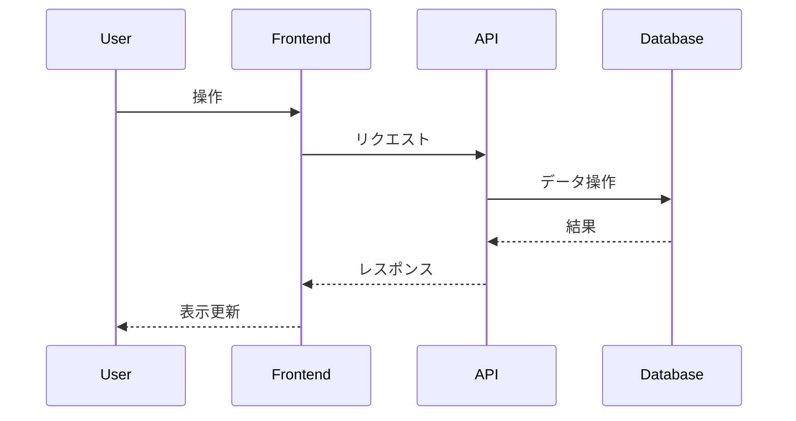

# Day44: Go仮想ルーター

## 概要

Go言語で仮想ルーターを実装し、Next.js製の管理画面から操作できるようにするプロジェクトです。

主な機能は以下の通りです。

- **Go (バックエンド):**
    - TUNデバイスを用いた仮想NICによるIPパケット送受信
    - Goroutineによるルーターインスタンスの動的管理
    - OSPF風の独自ダイナミックルーティングプロトコルによるルーティングテーブル自動更新
    - ルーターの状態やトポロジー変更をリアルタイムに通知するWebSocket API
    - ルーターの作成・削除・設定変更・接続管理を行うHTTP API
- **Next.js (フロントエンド):**
    - ネットワーク構成を視覚的に表示・操作できる管理画面
    - ドラッグ＆ドロップによるルーターの追加や接続操作
    - WebSocket経由でのリアルタイムな状態更新
    - 各ルーターの詳細情報（ルーティングテーブルなど）の表示

## デザイン
モダンで直感的なUIを目指し、ネットワークトポロジーの把握と操作のしやすさを重視します。
今回は**ニューモーフィズム**を基調とし、要素が背景から浮き出たり凹んだりするような、柔らかく立体的なデザインを採用します。

## 技術スタック

- **バックエンド:**
    - 言語: Go
    - フレームワーク/ライブラリ: `net/http`, `gorilla/websocket`, `songgao/water` (TUNデバイス操作)
    - ルーティング: OSPF風独自実装
- **フロントエンド:**
    - フレームワーク: Next.js (App Router)
    - 言語: TypeScript
    - スタイリング: Tailwind CSS
    - 状態管理: Zustand (または Jotai)
    - UIライブラリ: React Flow (ネットワーク図描画)
- **共通:**
    - API通信: HTTP, WebSocket

## アプリケーション概要

*ここに、この日に作成するアプリケーションの簡単な説明を記述します。*

## 機能一覧

*ここに、実装した機能の一覧を記述します。*

- 機能1
- 機能2
- ...

## ER図

*ここに、Mermaid 形式で ER 図を記述します。*

```mermaid
erDiagram
    // 例: User モデル
    User {
        int id PK
        string name
        datetime createdAt
        datetime updatedAt
    }
```

## シーケンス図 (オプション)

*必要であれば、主要な処理フローのシーケンス図を Mermaid 形式で記述します。*



## データモデル

*ここに、主要なデータモデルの概要を記述します。*

- モデル1: 説明
- モデル2: 説明
- ...

## 画面構成

*ここに、作成する主要な画面とその概要を記述します。*

- 画面1: 説明
- 画面2: 説明
- ...

## 使用技術スタック (テンプレート標準)

- フレームワーク: Next.js (App Router)
- 言語: TypeScript
- DB: SQLite
- DBアクセス: better-sqlite3（または同等のシンプルなSQLiteライブラリ）
- API実装: Next.js Route Handlers
- スタイリング: Tailwind CSS
- パッケージ管理: npm
- コード品質: Biome (Lint & Format)

## 開始方法

1. **依存パッケージをインストール**
   ```bash
   npm install
   ```

2. **開発サーバーを起動**
   ```bash
   npm run dev
   ```
   サーバ起動時に自動でSQLiteのテーブルが作成されます。
   ブラウザで [http://localhost:3001](http://localhost:3001) を開くと結果が表示されます。

3. **DBスキーマを変更したい場合**
   - `db/dev.db` ファイルを削除してください
   - 次回サーバ起動時に新しいスキーマで自動生成されます。

## 注意事項

- このテンプレートはローカル開発環境を主眼としています。
- 本番デプロイには追加の考慮が必要です。
- エラーハンドリングやセキュリティは簡略化されています。
